# STRYT — End-to-End Flow Audit

Every core flow, code-verified. Documents how **User A** and **User B** interact, who can do what at each state, every branch, a diagram, and what's missing for a best-in-class experience.

**Diagram legend:** `A:` = customer action · `B:` = business/provider (seller) action · `Sys:` = automatic/server-side · `Admin:` = admin action.

## Actors & the "hats" model
One login = one account. A person switches **context** (`activeContext`: `customer` / `business` / `provider`) via the RoleSwitcher dropdown. The same human can be A in one flow and B in another.

| Role | Who | Can initiate | Can respond to |
|------|-----|-------------|----------------|
| **Customer (A)** | Any signed-in user | Requests, appointments, queue joins, community posts, chats, ratings | — |
| **Business owner (B)** | User who onboarded a business | Everything a customer can + owner console | Appointments, queue, requests (as bidder), Q&A |
| **Provider (B)** | User who onboarded a provider profile | Same + provider console | Requests (as bidder), appointments, leads |
| **Admin** | Separate admin login | Moderation, verification review, disputes, escrow release | Everything read-only + overrides |

Guest (signed-out) can browse; any write prompts login. Mock/demo targets (`b1`,`p1`,`biz_mock_*`) fall back to local-only storage.

---

## FLOW 1 — Service Request → Agreement → Payment → Rating
The marketplace's core loop. `RequestStatus`: OPEN → IN_PROGRESS → AGREED → COMPLETED / CANCELLED / EXPIRED.

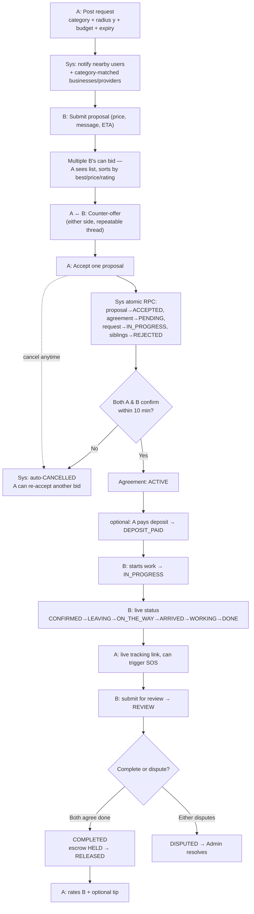

### 1.1 A posts a request (`AskCompose` → `requestService.create`)
- **A** picks: title, **category (required)**, subcategory (optional), description, budget min/max, payment type (fixed/hourly), photos (≤4), schedule, radius `y` (default 3km), expiry (3–24h, default 24h), toggles: urgent / recurring / **anonymous**.
- On post: row inserted `status=OPEN`, `requester_user_id=A`. Leaderboard +2 pts.
- **DB trigger `notify_on_request`** fans out notifications to: (a) all nearby *users* in radius, (b) **businesses whose `category_id` matches** (→ their leads tab), (c) **providers whose `category_id` matches** (→ their leads tab).
- **Anonymity**: if `is_anonymous`, A's name shows as "Someone nearby" and avatar is blanked everywhere until an agreement forms.

### 1.2 Visibility (who sees the request)
- Feed filter: viewer sees it only within `min(viewer's radius, request's radius y)` of the request point. Poster's radius is a hard cap.
- Business/Provider leads tab (`BusinessRequests`, `ProviderLeads`): filtered to **category match** + within their broadcast range. Uncategorized requests fall through to all.
- Auto-expiry: `close_expired_requests` RPC (throttled, ≤1 run / 2 min per client) flips past-expiry OPEN requests → EXPIRED.

### 1.3 B responds with a proposal (`SubmitProposal` → `submitProposal`)
- Any user/business/provider **except A** submits: price, message, ETA. `responderType` = user/business/provider; responder name = first-name (user) or business/real name (seller).
- Multiple B's can bid → A sees a list on `RequestDetail`, sortable by best/price/rating.
- **"Me too"** (`meToo`): other customers with the same need tap to +1 a request (social proof, `me_too_count` via trigger). Optional broadcast of a proposal to me-too'ers.

### 1.4 Negotiation — counter-offers (`submitCounter`)
- **Either A or B** posts a counter (amount + message) on a proposal → appended to `proposal_counters`. Bidirectional haggling thread. `by` = requester/responder.

### 1.5 A accepts a proposal (`acceptProposal` → `accept_proposal` RPC)
- **Only A** (request owner; enforced server-side). Atomic transaction:
  1. chosen proposal → ACCEPTED
  2. **Agreement created** (`status=PENDING`)
  3. request → IN_PROGRESS
  4. **all sibling proposals → REJECTED**
- Both parties notified.

### 1.6 Agreement confirmation (`AgreementScreen`, `confirmAgreement`)
`AgreementStatus`: PENDING → ACTIVE → DEPOSIT_PAID → IN_PROGRESS → REVIEW → COMPLETED / CANCELLED / DISPUTED.
- PENDING shows a **Confirmations** panel: **both A and B must confirm**. Each calls `confirmAgreement` (sets their own `requester_confirmed`/`responder_confirmed`). When both true → ACTIVE (race-safe: post-update read decides).
- **10-min window**: `cancel_expired_agreements` RPC auto-CANCELs PENDING agreements where both sides didn't confirm in time. Either party can also cancel manually. On cancel → A can "View Quotes Again" (re-accept another bid).

### 1.7 Live job tracking (`JobLiveStatus`, `updateLiveStatus`)
- **B (responder)** advances live status: CONFIRMED → LEAVING → ON_THE_WAY → ARRIVED → WORKING → DONE; can attach live lat/lng.
- **A** sees a live status banner. When ON_THE_WAY/ARRIVED, A can open live tracking.
- **`generateTrackingToken`** → shareable public link `/track/:token` (4h expiry) — anyone with the link watches B's live location (no login).
- **SOS** (`sosAlert`): A can trigger an emergency alert → Edge Function notifies A's emergency contact + B's identity + coords.

### 1.8 Money — escrow & completion
- `paymentMode`: OFFLINE (in-person / UPI) or ONLINE (Razorpay — gated, Edge Functions not deployed).
- Agreement flow: markDepositPaid → DEPOSIT_PAID; startWork → IN_PROGRESS; submitForReview → REVIEW.
- **`completeAgreement`** (COMPLETED): releases any `payments` row with `escrow_status=HELD` → RELEASED. Leaderboard +5.
- Escrow state is shown to A on the agreement: 🔒 HELD ("secured by STRYT until job completes") / ✓ RELEASED.
- **Admin** can also release/hold escrow and resolve disputes (`AdminPanel`).

### 1.9 Dispute (`dispute`)
- **Either party** → DISPUTED + reason. Surfaces to Admin queue.

### 1.10 Rating (`rate` / `RateScreen`)
- After COMPLETED, **A rates B** (and optionally tips): 1–5 stars + comment → `ratings` (ratee_type USER/BUSINESS/PROVIDER). Updates B's `rating_avg`/`rating_count` via trigger.

**Privilege matrix (Flow 1)**

| Action | A (requester) | B (responder) | Other users | Admin |
|--------|:-:|:-:|:-:|:-:|
| Post request | ✅ | ✅ | ✅ | — |
| See request | if in radius | if category+radius | if in radius | ✅ all |
| Submit proposal | ❌ (own) | ✅ | ✅ | — |
| Counter-offer | ✅ | ✅ | ❌ | — |
| Accept proposal | ✅ only | ❌ | ❌ | — |
| Confirm agreement | ✅ (req side) | ✅ (resp side) | ❌ | — |
| Advance live status | ❌ | ✅ | ❌ | — |
| Cancel agreement | ✅ | ✅ | ❌ | ✅ |
| Complete | ✅ | ✅ | ❌ | ✅ |
| Dispute | ✅ | ✅ | ❌ | resolves |
| Release escrow | ❌ | ❌ | ❌ | ✅ |
| Rate | ✅ | ❌ | ❌ | — |

**🎯 Add for max UX:**
- Visible **10-minute confirmation countdown** on PENDING agreements — both parties currently have no idea they're on a clock until it auto-cancels.
- **Nudge notification** to whichever side hasn't confirmed yet ("B is waiting on your confirmation — 3 min left").
- **Typical price range** for the category shown to A while proposals come in (set expectations, reduce lowball/overprice spread).
- **Response-time estimate** ("providers here usually reply in ~20 min") shown right after posting, to hold attention during the wait.
- **Before/after photo capture** on completion — quality proof for both sides, feeds future trust signals.
- **"Book B again" shortcut** from a completed agreement — repeat-hire is the highest-value retention loop and there's currently no fast path to it.
- **Cancellation reason** captured on manual cancel (dropdown, not free text) — cheap data, useful for trust/analytics.
- **Dispute status timeline** visible to both parties ("Under review since...", "Admin requested more info") instead of a silent black box.
- **Escrow release ETA** shown proactively ("funds release within 24h of completion") rather than only a static HELD/RELEASED badge.

---

## FLOW 2 — Appointment Booking → Payment
Direct booking against a business/provider listing. `AppointmentStatus`: PENDING → ACCEPTED → COMPLETED / REJECTED / CANCELLED / NO_SHOW.

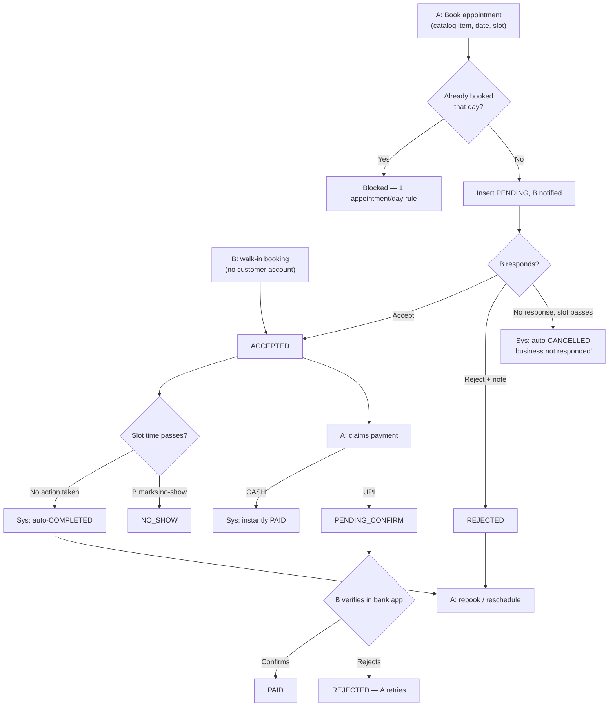

### 2.1 A books (`AppointmentSheet` → `appointmentService.create`)
- From a Business/Provider detail page, **A** picks a catalog item (as "package"), date, time slot, notes, optional photo.
- **Rule: one appointment per calendar day per customer** (enforced client-side).
- Insert `status=PENDING`, stamped with `target_owner_user_id` so **B sees it** in their console. Guest/mock → local only.

### 2.2 B responds (`BusinessAppointments` / `ProviderLeads`, `updateStatus`)
- **B** (owner) → ACCEPT (→ACCEPTED) or REJECT (→REJECTED, with note). Can also mark NO_SHOW after the slot.
- **Auto-housekeeping** on every list read: PENDING past its slot with no response → auto-CANCELLED ("business not responded", `cancelledBy=SYSTEM`); ACCEPTED past its slot → auto-COMPLETED.
- **Walk-in** (`createWalkIn`): B manually adds a booking from the timetable (phone/in-person customer, no account) → inserts `status=ACCEPTED, is_walk_in=true`, stamped to B's own uid.

### 2.3 Payment (`claimPayment` / `confirmPayment` / `rejectPaymentClaim`)
`PaymentStatus`: UNPAID → PENDING_CONFIRM → PAID / REJECTED.
- **A claims payment**: CASH → immediately PAID (physical handover). UPI → PENDING_CONFIRM.
- **B verifies** the UPI in their bank app → `confirmPayment` (→PAID) or `rejectPaymentClaim` (→REJECTED; A retries).

### 2.4 Rebook (`MyAppointments`)
- A can Reschedule or Rebook (again) a past/cancelled appointment — reopens the booking sheet pre-loaded with the target's catalog.

**Privilege matrix (Flow 2)**

| Action | A (customer) | B (owner) | Admin |
|--------|:-:|:-:|:-:|
| Book | ✅ | (walk-in only) | — |
| Accept/Reject | ❌ | ✅ | — |
| Mark NO_SHOW | ❌ | ✅ | — |
| Cancel | ✅ | ✅ | — |
| Claim payment | ✅ | — | — |
| Confirm/Reject payment | ❌ | ✅ | — |

**🎯 Add for max UX:**
- **Reminder notifications** (24h and 1h before) — nothing currently nudges A or B before a slot.
- **Add-to-calendar** (.ics export) on confirm — trivial to add, removes a real friction point.
- **Recurring bookings** ("every Tuesday, same time") for regulars — currently every booking is one-off.
- **Waitlist** when a slot is full, auto-offered if it frees up.
- **Customer no-show tracking symmetric to business no-show** — right now only B can mark NO_SHOW; a repeat-no-show customer has no consequence or flag.
- **Multi-item booking** (cart of 2+ catalog items in one slot) if a business's flow supports combo services.

---

## FLOW 3 — Live Queue
Walk-in virtual line for a business. `QueueTokenStatus`: WAITING → CALLED → SERVED / LEFT.

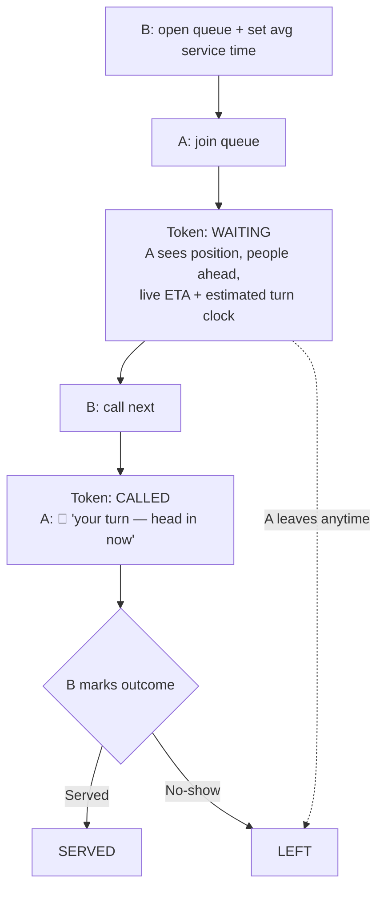

### 3.1 B opens the queue (`QueueManager`, `setQueueSettings`)
- **B** toggles queue ON + sets **avg service time** (drives every customer's ETA).

### 3.2 A joins (`joinQueueToken`)
- **A** joins from the business page → token `status=WAITING`, `customer_user_id=A`.
- A sees in `MyQueues`: position #, people ahead, **live ETA** (`peopleAhead × avgServiceMin`) + estimated turn clock ("~Around 4:35 PM").

### 3.3 B works the line (`callNextToken` / `serveToken` / `leaveQueueToken`)
- **B**: "Call next" → oldest WAITING → CALLED (shows in B's "Now serving" section). "Done" → SERVED. "✕ no-show" → LEFT.
- A's `MyQueues` updates live (realtime): CALLED shows prominent "🔔 It's your turn — head in now!".
- **A can leave** anytime (→ LEFT).

**Privileges**: A joins/leaves; B opens/sets-time/calls/serves/removes. Both see live via `queue_tokens` realtime subscription.

**🎯 Add for max UX:**
- **Push/SMS fallback for "you're called"** — currently in-app realtime only; if the app is backgrounded and push isn't set up, A misses their turn entirely (see Flow 3 gap in the earlier UX audit).
- **Pre-join ETA preview** — A currently only sees wait time *after* joining; showing it on the business page before joining lets people decide if it's worth it.
- **"Running late" self-service** — let A push themselves back a few spots instead of losing their place entirely by leaving.
- **Group/party-size aware ETA** — if multiple people are being served per token, factor that into the estimate.

---

## FLOW 4 — Community Posts
`CommunityPostType`: LOST_FOUND, ALERT, RECOMMENDATION, GIVEAWAY, POLL, SHOUTOUT. Posted to the neighborhood feed within radius.

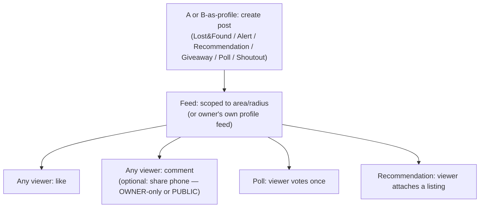

### 4.1 A (or B-as-profile) posts (`CommunityCompose` → `create`)
- **Author identity**: a customer posts as themselves; a business/provider owner posts **as that profile** (carried via `author_type`/`author_ref_id`) — reachable from their manage console's "My Community" (`ProfileCommunity`), which shows only that profile's posts + their own requests.
- Types carry extra fields: POLL → options; RECOMMENDATION → attached listings.

### 4.2 B/other users interact (`like` / `vote` / `addComment` / `recommendListing`)
- **Anyone in feed**: like (toggle), vote on a poll (once), comment. A commenter can **share their phone** in a comment with visibility OWNER-only or PUBLIC.
- **Recommend a listing**: any user attaches a business/provider to a RECOMMENDATION post.
- Feed scoped by area/radius; owner's own feed scoped to their profile.

**🎯 Add for max UX:**
- **Reply notifications** — post a comment on someone's post/comment, they get no push signal today.
- **Report → resolution visibility** — a reported post disappears from the reporter's view with no confirmation it was actioned.
- **"Trending nearby" sort** — currently just reverse-chronological; a lightweight engagement-weighted sort would surface what actually matters.

---

## FLOW 5 — Stories (ephemeral)

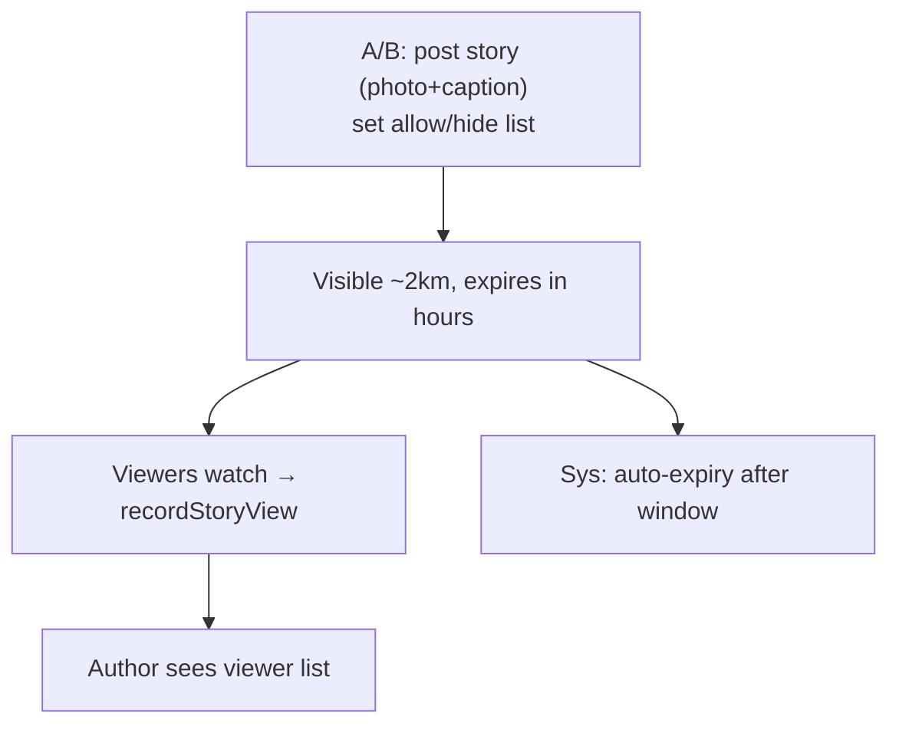
- **A/B** posts a story (photo + caption, `postStory`), visible ~2km, expires (hours). Privacy: allow/hide specific users.
- Viewers: `recordStoryView` tracks seen; author sees `getStoryViewers`. Appear in StoriesBar (home) + on the map (story layer).

**🎯 Add for max UX:** quick-reaction (emoji tap) instead of only full comments; "save to highlights" so a useful story (e.g. a real recommendation) doesn't just vanish after a few hours.

---

## FLOW 6 — Direct Chat

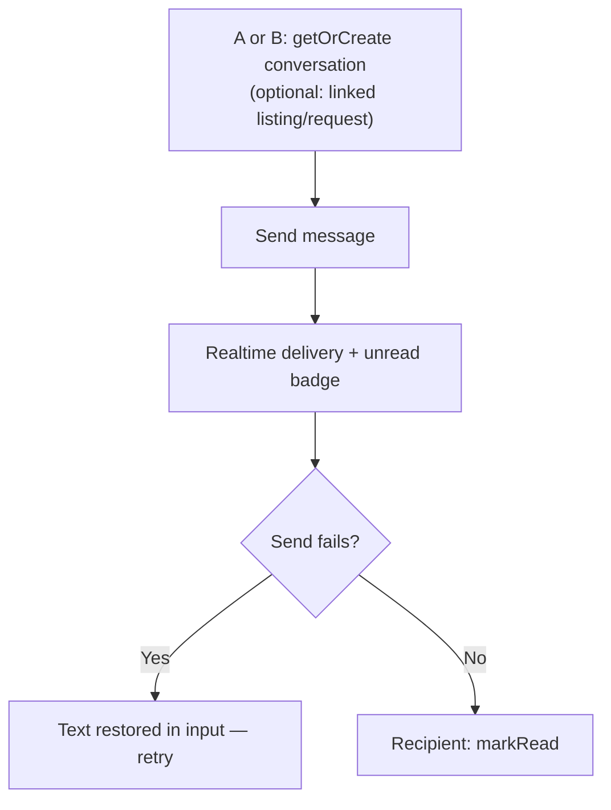
- **A ↔ B** 1:1 (`getOrCreate` by other user id, optional subject linking a listing/request). `send` / `messages` / `markRead`; realtime + unread badges. Restore-on-fail (text kept if send errors).

**🎯 Add for max UX:** image/photo attachments (text-only today — awkward for "is this the part you meant?" conversations); typing indicator; visible read receipts (data already tracked via `markRead`, just not surfaced to the sender).

---

## FLOW 7 — Q&A on a business

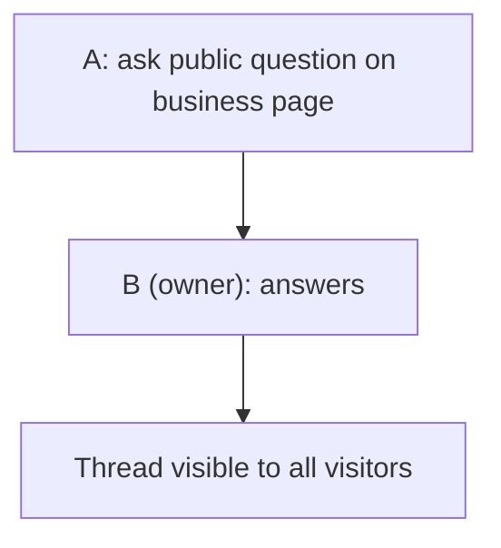
- **A** asks a public question on a BusinessDetail (`business_qna`); **B (owner)** answers from `QnaManager`. Public thread.

**🎯 Add for max UX:** upvote on unanswered questions (surfaces what most visitors actually want to know); "verified answer" mark once B replies, so scanning the thread is faster.

---

## FLOW 8 — Discovery

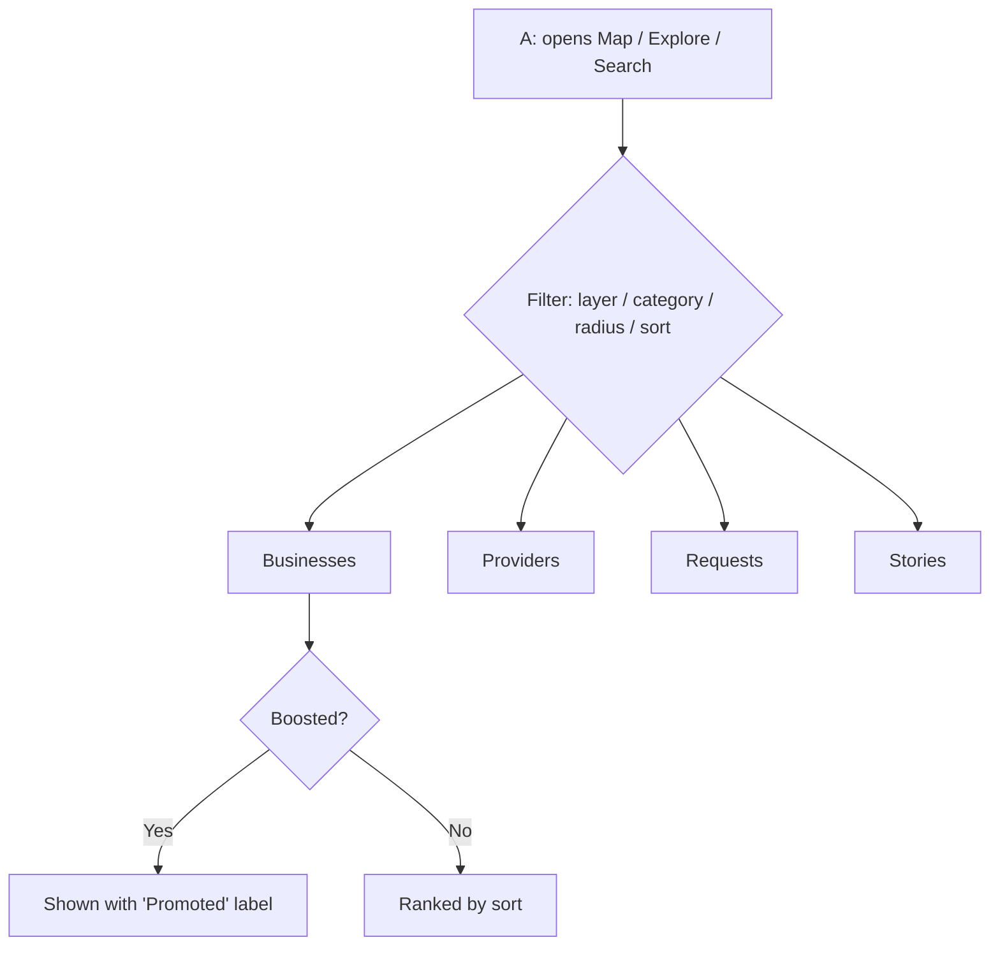
- **Map** (`MapView`): layers business/provider/request/story within radius; "available now" filter; long-press / pin-drop to set location; nearby sheet lists by tab.
- **Explore**: category + radius + sort (nearby/rating/new), business & provider cards.
- **Search**, **Category listing**, **Available-now** rail.
- Paid placement shows a **"Promoted"** label (transparency) on boosted cards.

**🎯 Add for max UX:** **saved search alerts** ("notify me when a plumber joins nearby") — turns one-time browsing into a re-engagement hook; recently-viewed rail.

---

## FLOW 9 — Reputation & Social (currently 4 parallel mechanisms)

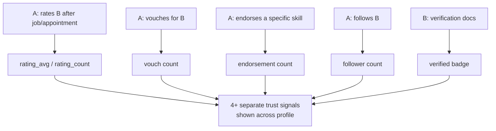
- **Ratings** (post-job/appointment stars) — the primary trust signal.
- **Vouches** (`toggleVouch`) — neighbor vouches for a provider.
- **Endorsements** (`toggleEndorse`) — endorse a specific skill.
- **Follow** (`toggleFollow`) + follower counts.
- Verification badge (KYC).

**🎯 Add for max UX:** consolidate to **ratings + verified badge** as primary, fold vouches/endorsements into rating-comment tags (e.g. auto-suggested skill tags on a 5-star review) instead of four separate taps a visitor has to interpret independently. Add a **"verified booking"** tag on ratings tied to a real completed agreement/appointment (proves the review is genuine, not just a follow-swap).

---

## FLOW 10 — Onboarding to Seller

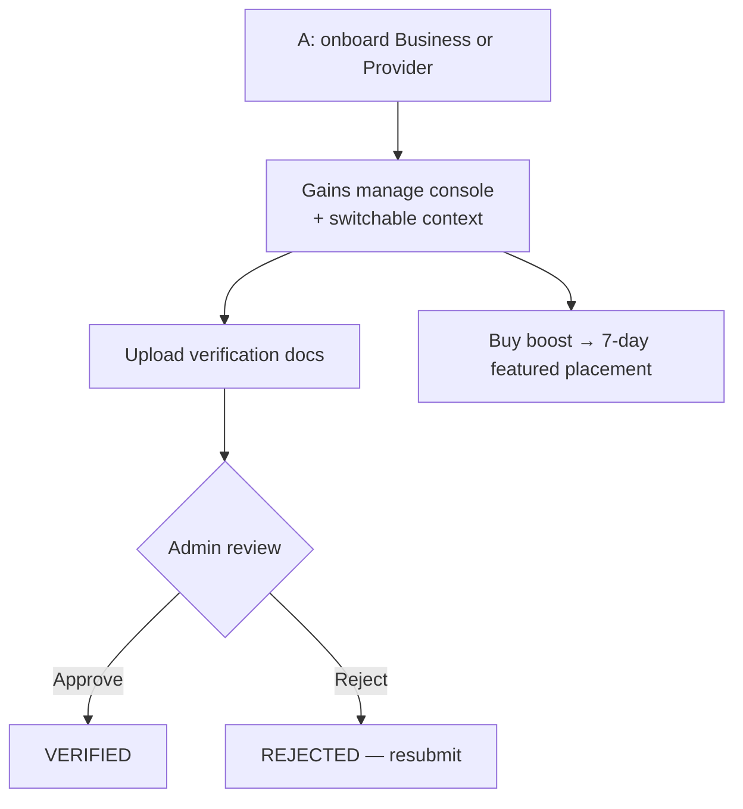
- **A → B**: any customer onboards a **Business** (`BusinessOnboard`) or **Provider** (`ProviderOnboard`) → gains that console + context. Switch hats via RoleSwitcher.
- **Verification** (`VerificationCenter`, business): upload docs → `verification_status` UNDER_REVIEW → Admin APPROVED/REJECTED. (Entry point now only in Settings — dashboard tile removed.)
- **Boost** (`buyBoost`): B buys 7-day featured placement → `is_boosted` + `boosted_until`.

**🎯 Add for max UX:** **guided setup checklist** with a progress bar on first entering the console (add catalog item → set hours → upload verification → post first community update) — new sellers currently land on a full dashboard with no ordered path; **push notification on verification decision** (approve/reject) instead of requiring a Settings visit to discover it; **boost expiry reminder** a day before it lapses.

---

## FLOW 11 — Location-Sharing Consent

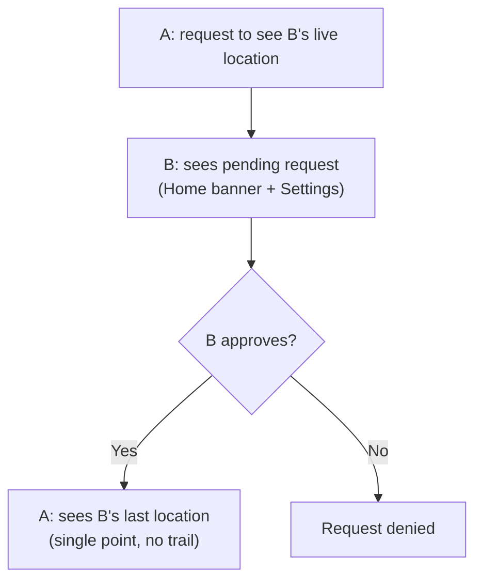
- **A requests** to see **B's** live location (`locationService.request`). B sees pending requests (Home banner + Settings) → approve/deny. Only approved neighbors see exact pins; "last location only, never a trail."

**🎯 Add for max UX:** **auto-expiring grants** (e.g. access lapses after 24h unless renewed) rather than an indefinite approval; a single always-visible "who can see my location" list in Settings for one-tap revoke, instead of only surfacing at request time.

---

## Cross-cutting privileges & guards
- **RLS**: writes stamped/scoped to `auth.uid()`; owners see only their listings' data; public reads open where intended.
- **Session/auth**: 401 mid-session → "Session expired" prompt; deep links preserved via `returnTo`.
- **Admin overrides**: verification review, dispute resolution, escrow hold/release, profile suspend/delete, PII masked in directory.
- **Self-healing**: expired requests/agreements/appointments auto-transition server-side or on read; profile rows self-create on first authed read.

## Priority roadmap — top adds ranked by leverage
1. **10-min confirmation countdown + nudge** (Flow 1) — cheap, directly reduces avoidable auto-cancels.
2. **Push/SMS fallback for "queue called" and "verification decision"** (Flows 3, 10) — closes real missed-notification gaps already flagged.
3. **Appointment reminders + calendar export** (Flow 2) — standard expectation, currently absent entirely.
4. **"Book B again" repeat-hire shortcut** (Flow 1) — highest-leverage retention feature, currently zero-click path doesn't exist.
5. **Saved search alerts** (Flow 8) — turns passive browsing into a re-engagement channel.
6. **Guided seller onboarding checklist** (Flow 10) — new sellers currently face a full dashboard with no ordered first steps.
7. **Consolidate reputation to ratings + verified badge** (Flow 9) — reduces trust-signal clutter, ties back to the minimalism pass.
8. **Dispute/escrow status timeline visible to customer** (Flow 1) — closes a known trust gap.
