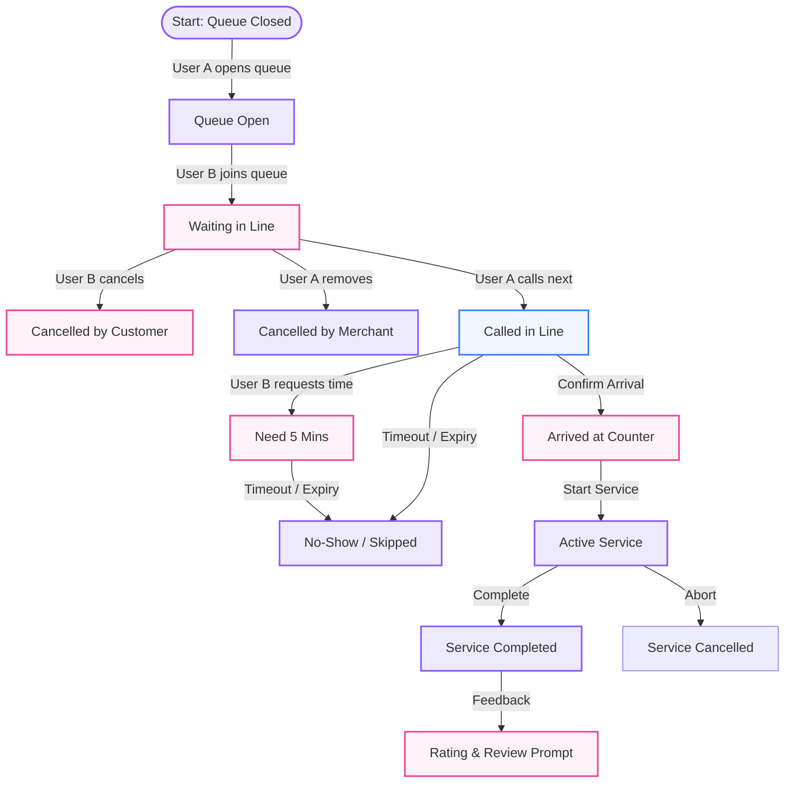

# STRYT Live Queue System: Full Simulation & Possibility Flow

This document details the step-by-step interactive flow between **User A (Business Owner / Merchant)** managing a Live Queue and **User B (Customer / Neighbor)** joining and progressing through the queue.

---

## 1. Actor Definitions & Roles

* **User A (Business Owner / Merchant)**
  * **Goal:** Control the flow of customers, manage service slots, reduce wait congestion, and optimize counter transactions.
  * **Interface:** Business Console Dashboard $\rightarrow$ Queue Manager.
  * **Privileges:** Configure queue parameters, open/close queue, call next, skip no-shows, mark arrived/serving/completed, and pause entries.
* **User B (Customer / Neighbor)**
  * **Goal:** Request to join a line virtualized, track position remotely, and receive alerts when it is their turn.
  * **Interface:** Customer App $\rightarrow$ Shop Profile & Home Dashboard Widget.
  * **Privileges:** Join queue, specify group size, add custom requests, request additional time when called, chat with the shop, and leave the queue.

---

## 2. Dynamic State Machine Diagram

---

## 3. Comprehensive Possibility Flow

### Phase 1: Setup & Queue Open (User A)
1. **User A** opens the STRYT Console, navigates to **Queue Manager**, and taps **Open Live Queue**.
2. **Options & Inputs configured by User A:**
   * **Capacity Limit:** Maximum number of active waiting entries allowed in line.
   * **Est. Wait Time per slot:** E.g., 5 mins per person (calculates total wait times dynamically).
   * **Alert Threshold:** Minimum positions remaining before automatically preparing next in line.
3. **Result:** Queue status changes to `OPEN`. The shop profile displays a live status widget: `🎟️ Virtual Queue Open (0 waiting, Est. wait 0 mins)`.

---

### Phase 2: Joining the Queue (User B)
1. **User B** visits User A's shop profile on the web or native app.
2. **User B** taps **Join Live Queue**.
3. **Options & Inputs entered by User B:**
   * **Group Size:** Number of people accompanying (1 to 10).
   * **Notes / Special Request:** E.g. "Need outdoor table", "Prefer window seat".
4. **Different Possibilities & System Guardrails:**
   * **Possibility 2A (Success):** Queue has capacity. User B is added. Status becomes `WAITING`. User B is assigned a token number (e.g. `#12`) and position (`1st in line`).
   * **Possibility 2B (Queue Full):** Queue reached capacity. Join button is disabled, replaced with `Queue Full - Check back later`.
   * **Possibility 2C (Already In Queue):** User B is already waiting in another queue at this specific shop. The system blocks double-entry: `You are already holding token #8 in this queue`.
   * **Possibility 2D (Store Closed Queue):** User A turns off queue entries mid-day. Status changes to `CLOSED`. Customers currently in line are kept, but new entries are blocked.

---

### Phase 3: Waiting in Line (User B - WAITING)
While status is `WAITING`, User B tracks their progress in real-time.
1. **User B Options & Privileges:**
   * **Live Position Tracker:** Displays current position (e.g. "3 people ahead of you") and dynamic estimated countdown.
   * **Cancel / Leave Queue:** User B decides not to wait, taps **Leave Line**. 
     * *Result:* Status set to `CANCELLED_BY_CUSTOMER`. Slot is freed. Neighbors behind them move up one slot.
   * **Contact Shop:** User B opens chat thread directly linked to their queue slot to message User A (e.g. "Traffic is bad, will be there in 10").
2. **User A Options & Privileges:**
   * **Manage Board:** Sees User B's entry with avatar, notes, group size, and wait time.
   * **Manual Kick:** User A removes User B from list.
     * *Result:* Status set to `CANCELLED_BY_MERCHANT`. User B receives alert: *"You were removed from the queue at [Shop Name]"*.

---

### Phase 4: Called In (User B - CALLED)
User A is ready for the next customer. User A clicks **Call Next** on User B's slot.
1. **Alert Actions:** System issues high-priority push notification and SMS to User B: *"🔔 It's your turn at [Shop Name]! Please proceed to the checkout/counter immediately."*
2. **Called State Options & Privileges:**
   * **Possibility 4A (Customer Arrives & Confirms):** User B reaches counter, taps **"I'm Here"** on their app (or User A taps **"Check In"**).
     * *Result:* Status transitions to `ARRIVED`.
   * **Possibility 4B (Customer Requests Extra Time):** User B is nearby but needs a moment. Taps **"Need 5 Mins"**.
     * *Result:* User A receives alert on console: *"Token #12 requested 5 extra minutes"*. User B's slot displays a yellow indicator.
   * **Possibility 4C (No-Show Timeout / Skip):** User B does not arrive. After the call timeout expires (e.g., 5 mins) or User A decides to proceed:
     * User A taps **"Skip / No-Show"**.
     * *Result:* Status transitions to `NO_SHOW`. Slot is archived. User A calls next.

---

### Phase 5: Active Service (User B - SERVING)
User B is at the counter/table. User A starts the transaction/service.
1. **User A transitions slot status to `SERVING`:**
   * User B's dashboard widget displays: `⚡ You are being served`.
2. **Possibility 5A (Service Completed Successfully):** User A completes the sale or service, then taps **Complete Session**.
   * *Result:* Status transitions to `COMPLETED`. User B is removed from active line.
3. **Possibility 5B (Service Cancelled mid-way):** E.g. payment failure, order issue. User A taps **Cancel Session**.
   * *Result:* Status transitions to `CANCELLED`.

---

### Phase 6: Post-Service Rating & Review
1. **Trigger:** Status changes to `COMPLETED`.
2. **User B Experience:** A feedback card appears on User B's home feed: *"How was your experience at [Shop Name]?"*
3. **Action:** User B selects star rating (1 to 5 stars) and writes a review.
4. **Result:** Rating is added to User A's merchant stats, and review is posted to the shop profile.

---

## 4. Summary Matrix of State Transitions & Actions

| State | Trigger Action | Performed By | Customer Display | Merchant Action Options |
| :--- | :--- | :--- | :--- | :--- |
| **CLOSED** | Initial state / Manual Close | User A | "Queue Closed" | Open Queue |
| **OPEN** | "Open Live Queue" click | User A | "Join Queue" button | Close Queue, Adjust Capacity |
| **WAITING** | "Join Queue" submit | User B | "Token #X, Y people ahead" | Call Next, Remove, Chat |
| **CALLED** | "Call Next" click | User A | "🔔 Proceed to counter!" | Mark Arrived, Skip (No-Show), Serve |
| **SERVING** | "Start Serving" click | User A | "⚡ You are being served" | Complete Session, Cancel |
| **COMPLETED**| "Complete Session" click | User A | "Rate your experience" | View history logs |
| **NO_SHOW** | "Skip" click / Timeout | User A | "Missed slot" | View history logs |
