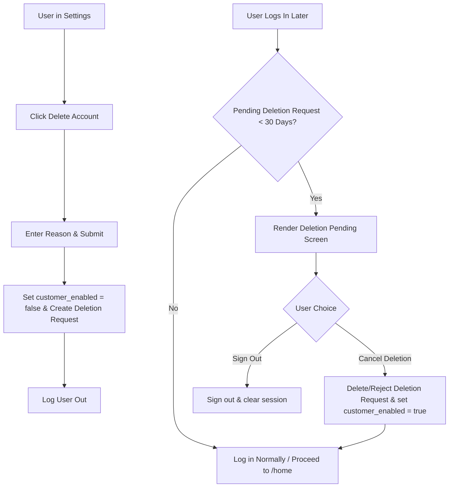

# High-Level & Low-Level Design: 30-Day Account Deletion Flow (Instagram-Style)

This document provides the design specification for implementing an Instagram-style account deletion grace period. When a user requests deletion, their profile is immediately hidden, and they are given 30 days to log back in and cancel the request.

---

## 1. High-Level Design (HLD)

### 1.1 Core Requirements
1. **Immediate Hide (Soft Delete)**: Upon submitting a deletion request, the user's `customer_enabled` flag is set to `false`, immediately hiding them from public search, maps, listings, and directories.
2. **Grace Period (30 Days)**: The account is scheduled for permanent purge 30 days after the request date.
3. **Login Interception (Grace Period Veto)**: If the user logs back in during the 30-day window, their navigation is blocked, and they are shown a screen stating when their account is scheduled to be deleted and offering a button to cancel the deletion.
4. **Restoration**: If the user cancels the deletion, the request is marked as `REJECTED` or deleted, `customer_enabled` is set back to `true`, and they are returned to `/home`.
5. **Admin Queue Visibility**: Deletion requests are displayed in the Admin Panel's Deletion Queue, showing the remaining days of the grace period (e.g., "Ready for Purge" vs. "24 days remaining").

### 1.2 User Flow



---

## 2. Low-Level Design (LLD)

### 2.1 Database & Service Updates (`src/services/userService.ts`)
We will update `userService.me()` to inspect `profile_deletion_requests` and append `deletionScheduledAt` to the returned user profile.

```typescript
// src/types.ts - Update CurrentUser interface
export interface CurrentUser {
  // ... existing fields
  deletionScheduledAt?: string | null;
}

// src/services/userService.ts
// Add query to userService.me()
const { data: delReq } = await sb
  .from("profile_deletion_requests")
  .select("created_at")
  .eq("user_id", uid)
  .eq("target_type", "CUSTOMER")
  .eq("status", "PENDING")
  .maybeSingle();

const deletionScheduledAt = delReq 
  ? new Date(new Date(delReq.created_at).getTime() + 30 * 24 * 60 * 60 * 1000).toISOString()
  : null;
```

---

### 2.2 Profile Control Service (`src/services/profileControlService.ts`)
Update `requestDeletion` to disable the profile and add `cancelDeletion`:

```typescript
// src/services/profileControlService.ts
async requestDeletion(targetType: ProfileTarget, targetId: string | null, reason: string): Promise<void> {
  const sb = getSupabase();
  const { data: { session } } = await sb.auth.getSession();
  if (!session || !session.user) throw new Error("Authentication required");

  // 1. Insert deletion request
  const { error } = await sb.from("profile_deletion_requests").insert({
    user_id: session.user.id,
    target_type: targetType,
    target_id: targetId,
    reason,
    status: "PENDING",
  });
  throwIfError(error);

  // 2. If customer account, soft-disable immediately
  if (targetType === "CUSTOMER") {
    const { error: userErr } = await sb
      .from("users")
      .update({ customer_enabled: false })
      .eq("id", session.user.id);
    if (userErr) console.warn("Failed to soft-disable user:", userErr.message);
  }
},

async cancelDeletion(): Promise<void> {
  const sb = getSupabase();
  const { data: { session } } = await sb.auth.getSession();
  if (!session || !session.user) throw new Error("Authentication required");

  // 1. Delete/Cancel pending request
  const { error } = await sb
    .from("profile_deletion_requests")
    .delete()
    .eq("user_id", session.user.id)
    .eq("target_type", "CUSTOMER")
    .eq("status", "PENDING");
  throwIfError(error);

  // 2. Re-enable user profile
  const { error: userErr } = await sb
    .from("users")
    .update({ customer_enabled: true })
    .eq("id", session.user.id);
  throwIfError(userErr);
}
```

---

### 2.3 Route Guard Updates (`src/App.tsx`)
Create a new guard check for pending deletions:

```typescript
// Inside ProtectedLayout
const isDeletionPending = isAuthed && user.id && user.deletionScheduledAt;

// Prevent routing if deletion is pending, EXCEPT to the warning screen itself
if (isDeletionPending && location.pathname !== "/auth/deletion-pending") {
  return <Navigate to="/auth/deletion-pending" replace />;
}
```

---

### 2.4 Deletion Warning Screen (`src/screens/auth/DeletionPending.tsx`) [NEW]
A visually striking page styled with dark accents and warn warnings:

- **Visual Theme**: Premium dark container with neon amber accents (`#d97706`).
- **Main Heading**: "Account Scheduled for Deletion".
- **Dynamic Date calculation**: Shows exact days remaining in the 30-day grace period.
- **CTAs**:
  - `Keep Account` (restores profile via `profileControlService.cancelDeletion()`).
  - `Sign Out` (logs out).

---

### 2.5 Admin Panel Details (`src/screens/admin/AdminPanel.tsx`)
Modify the Deletion Queue list item rendering to calculate and display:
- Days left in the grace period (e.g., `30 - (CurrentDate - RequestDate)`)
- Visual badge changes:
  - 🟡 **Pending (X days left)** if < 30 days.
  - 🔴 **Ready to Purge** if >= 30 days.

```typescript
// Inside AdminPanel deletion request rendering
const reqDate = new Date(req.createdAt);
const purgeDate = new Date(reqDate.getTime() + 30 * 24 * 60 * 60 * 1000);
const daysLeft = Math.ceil((purgeDate.getTime() - Date.now()) / (1000 * 60 * 60 * 24));
const readyToPurge = daysLeft <= 0;
```
