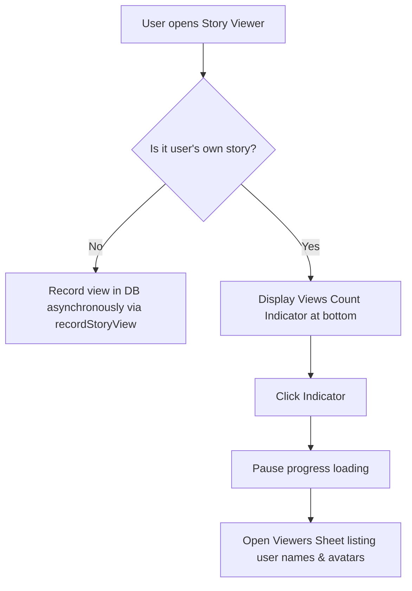
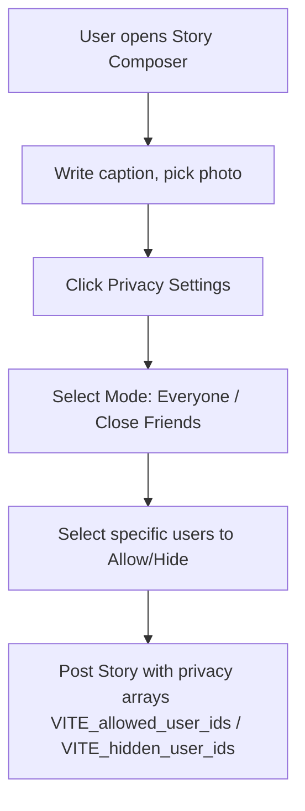

# High-Level & Low-Level Design: Story Views & Privacy Settings (Instagram-Style)

This document specifies the design to add Instagram-style story views (views count, list of viewers) and story privacy options (sharing with "Everyone" or "Close Friends" and hiding from specific users).

---

## 1. High-Level Design (HLD)

### 1.1 Core Requirements
1. **Persistent Views Tracking**: When a user views a story, the view is recorded in the database, tracking the viewer's ID and timestamp.
2. **Viewer List (For Story Owners)**: When the owner views their own story, they see a views count indicator (e.g. `👁 5 views`). Tapping this opens a bottom sheet showing the list of users who have viewed their story.
3. **Story Privacy Settings**:
   - **Everyone**: Publicly visible to all nearby neighbors.
   - **Close Friends**: Visible only to a selected group of neighbors.
   - **Hide From**: Hidden from specific selected users.
4. **Privacy Enforcement**: The story fetch queries filter out stories that the requesting user is not authorized to see.

### 1.2 User Flow

#### A. Story View Tracking & Viewers Sheet


#### B. Story Composer Privacy Flow


---

## 2. Low-Level Design (LLD)

### 2.1 Database Schema (`supabase/migration_r15.sql`) [NEW]
We need to create the `story_views` table and add privacy columns to the `stories` table.

```sql
-- 1. Add privacy columns to stories table
alter table public.stories
  add column if not exists visibility text not null default 'everyone',
  add column if not exists allowed_user_ids text[] default '{}',
  add column if not exists hidden_user_ids text[] default '{}';

-- 2. Create story_views table
create table if not exists public.story_views (
  id uuid primary key default gen_random_uuid(),
  story_id uuid not null references public.stories(id) on delete cascade,
  viewer_user_id text not null references public.users(id) on delete cascade,
  created_at timestamptz not null default now(),
  unique(story_id, viewer_user_id)
);

-- 3. Enable RLS on story_views
alter table public.story_views enable row level security;

create policy read_story_views_owner on public.story_views
  for select using (
    exists (
      select 1 from public.stories s
      where s.id = story_views.story_id and s.user_id = auth.uid()::text
    )
  );

create policy insert_story_views_viewer on public.story_views
  for insert with check (
    viewer_user_id = auth.uid()::text
  );
```

---

### 2.2 API & Service Layer (`src/services/socialService.ts`)
We will add functions to record views, fetch viewers, and apply client-side visibility filters.

```typescript
// Update rowToStory mapping in socialService.ts
function rowToStory(row: Record<string, unknown>): Story {
  return {
    // ... existing mapping
    visibility: (row.visibility as string) ?? "everyone",
    allowedUserIds: (row.allowed_user_ids as string[]) ?? [],
    hiddenUserIds: (row.hidden_user_ids as string[]) ?? [],
  };
}

// Add these methods in socialService:
async recordStoryView(storyId: string): Promise<void> {
  const sb = getSupabase();
  const uid = await currentUserId();
  if (!uid) return;

  await sb.from("story_views").upsert(
    { story_id: storyId, viewer_user_id: uid },
    { onConflict: "story_id,viewer_user_id" }
  );
},

async getStoryViewers(storyId: string): Promise<any[]> {
  const sb = getSupabase();
  const { data, error } = await sb
    .from("story_views")
    .select("created_at, viewer:users!viewer_user_id(id, name, avatar)")
    .eq("story_id", storyId)
    .order("created_at", { ascending: false });

  if (error) throw error;
  return (data || []).map((v: any) => ({
    userId: v.viewer?.id,
    name: v.viewer?.name,
    avatar: v.viewer?.avatar,
    viewedAt: v.created_at,
  }));
},

async getStoryViewsCount(storyId: string): Promise<number> {
  const sb = getSupabase();
  const { count, error } = await sb
    .from("story_views")
    .select("*", { count: "exact", head: true })
    .eq("story_id", storyId);
  if (error) throw error;
  return count || 0;
}
```

#### Privacy Filter inside `stories()` and `storiesNearby()`:
```typescript
// Filter restricted stories on retrieval
const currentUid = await currentUserId();
return (data ?? [])
  .map(rowToStory)
  .filter((s) => {
    if (s.userId === currentUid) return true; // Author can always see their own
    if (s.hiddenUserIds?.includes(currentUid)) return false; // Hidden from user
    if (s.visibility === "close_friends" && !s.allowedUserIds?.includes(currentUid)) return false; // Close friends only check
    return true;
  });
```

---

### 2.3 UI - Story Composer (`src/screens/StoryCompose.tsx`)
We will add an interactive modal to customize privacy settings:
- Toggle visibility between **Everyone** and **Close Friends**.
- Choose specific users to hide from.
- Render user search list using checked state.
- Include `visibility`, `allowedUserIds`, and `hiddenUserIds` in the payload passed to `socialService.postStory()`.

---

### 2.4 UI - Story Viewer (`src/components/Stories.tsx`)
We will update `StoryViewer`:
- Track if the active story belongs to `user.id`.
- If so, fetch the views count and render a pill at the bottom-left of the story showing an Eye icon and count (e.g. `👁 12`).
- Clicking this pill pauses progress and opens a bottom sheet showing the list of viewers (avatar, name, viewed time).
- Asynchronously record views for other users' stories when a story is viewed.
