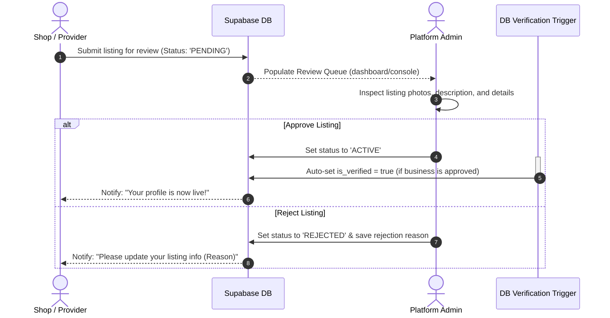
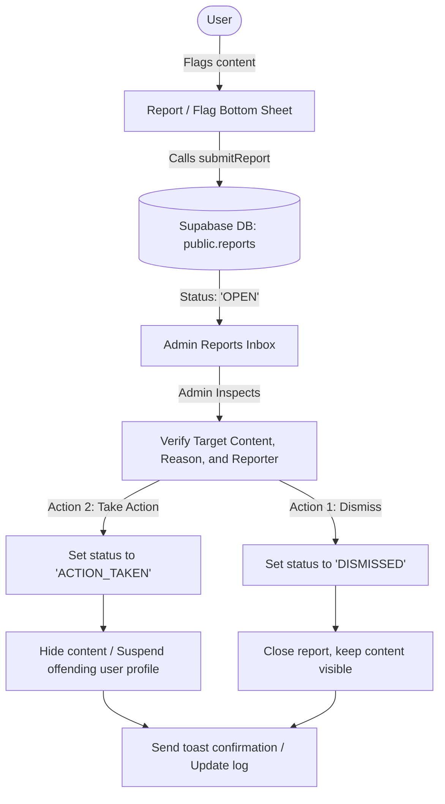

# Admin Role Pipeline & Moderation Model

This report details how **Naya** handles system operations, moderation, and quality control via the **Admin Console**, covering:
1. Admin authentication and database authorization.
2. The moderation queue pipeline for approving local listings.
3. The flagging and reports resolution pipeline.
4. Operational metrics and dashboard monitoring.

---

## 1. Authentication & Security Framework

Admin operations are secured using a dual-layer authentication and authorization system:

```
[Frontend Admin Console] ──► Mock Login Form ──► Bypasses client-side credentials
                                                      │
                                                      ▼
[Database Operations]   ──► RLS Query Check ──► verifies auth.uid() in users table
                                                      │
                                                      ├─► Has 'admin' role? ──► ALLOW Query (SELECT/UPDATE)
                                                      └─► No 'admin' role?  ──► DENY Query (Postgres Error)
```

### Authorization Mechanics:
* **Frontend Screen (`AdminPanel.tsx`)**: Accepts any email and password to enter the admin page client-side. This allows developers to inspect the admin UI layout instantly.
* **Backend Security (RLS Policies)**: Every service query (approvals, rejects, reports) is checked on the database level via Row Level Security (RLS) policies:
  ```sql
  WHERE u.id = auth.uid()::text AND 'admin' = ANY(u.roles)
  ```
  Only sessions signed in with a phone number that has the `'admin'` role assigned in the `public.users` table (such as the seeded developer admin account `u1` linked to phone number `+91 98123 45670`) can successfully execute these database operations.

---

## 2. Moderation & Listing Review Pipeline

To maintain neighborhood safety and quality, all new shops, service providers, and category proposals must be approved before appearing in local discovery feeds:



### Review Queue Channels (`adminService.queue`):
1. **Shops (Businesses)**: Moderating storefront names, descriptions, sub-categories, and cover photos.
2. **Providers**: Checking credentials, skill tags, portfolio galleries, and standard packages.
3. **Categories**: Reviewing customer-proposed root or sub-categories. Once approved, the node status is updated to `ACTIVE` and becomes available in the global taxonomy tree.

---

## 3. Flagging & Content Moderation Pipeline

When a resident reports inappropriate content (e.g., spam requests, fake reviews, or abusive comments), it enters the flagging queue for admin intervention:



### Reports Schema Fields (`public.reports`):
* `target_type`: The type of content reported (`business`, `provider`, `request`, `social_post`, `comment`).
* `target_id`: Database reference key to the specific item.
* `reason`: Categorized selection (e.g., *Spam*, *Inappropriate*, *Scam*, *Inaccurate*).
* `details`: Text description provided by the reporter.
* `reporter_user_id`: Links back to the user who flagged the item.

---

## 4. Operational Dashboard & KPIs

The admin overview dashboard (`adminService.overview()`) aggregates metrics from across the database to track hyperlocal platform activity:

| Metric Group | Source Tables | System Purpose |
| :--- | :--- | :--- |
| **Businesses & Providers** | `public.businesses`, `public.providers` | Total active supply counts on the platform. |
| **Open Requests** | `public.requests` where `status = 'OPEN'` | Measures active marketplace demand. |
| **Completed Agreements** | `public.agreements` where `status = 'COMPLETED'` | Measures successful local transactions. |
| **New Today** | Combined inserts in the past 24 hours | Measures daily onboarding velocity. |
| **Pending Review** | Combined `PENDING` statuses | Lists backlog items needing moderator attention. |
| **DAU / MAU** | (Analytics logs placeholder) | Tracks user retention and daily traffic. |
