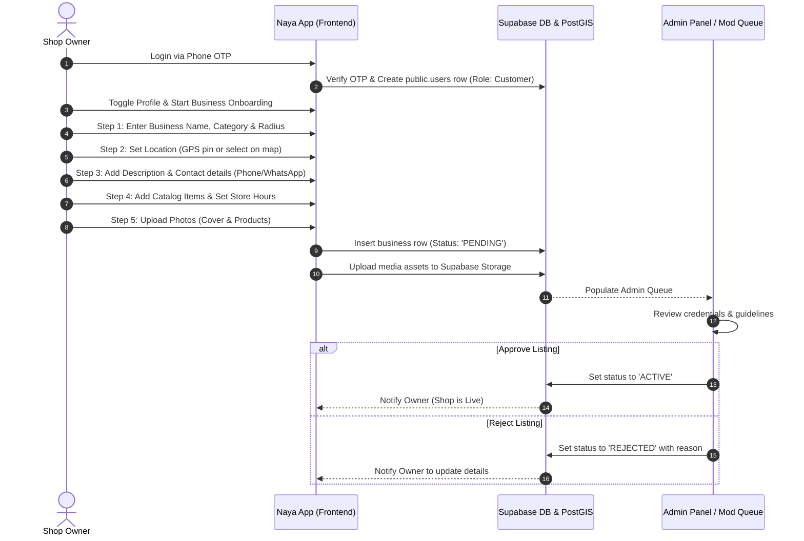
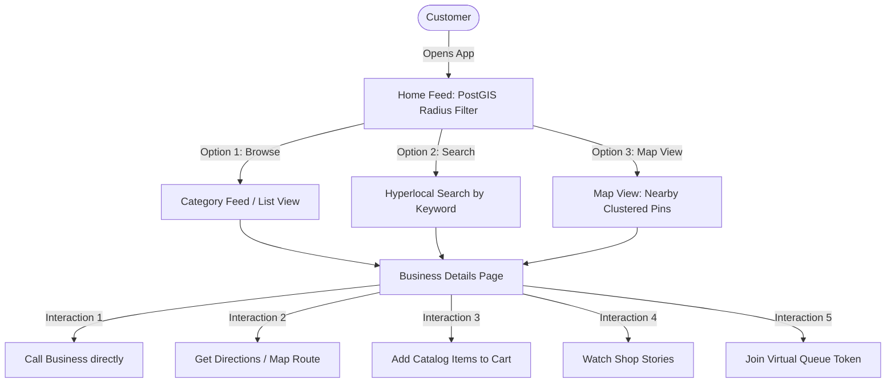
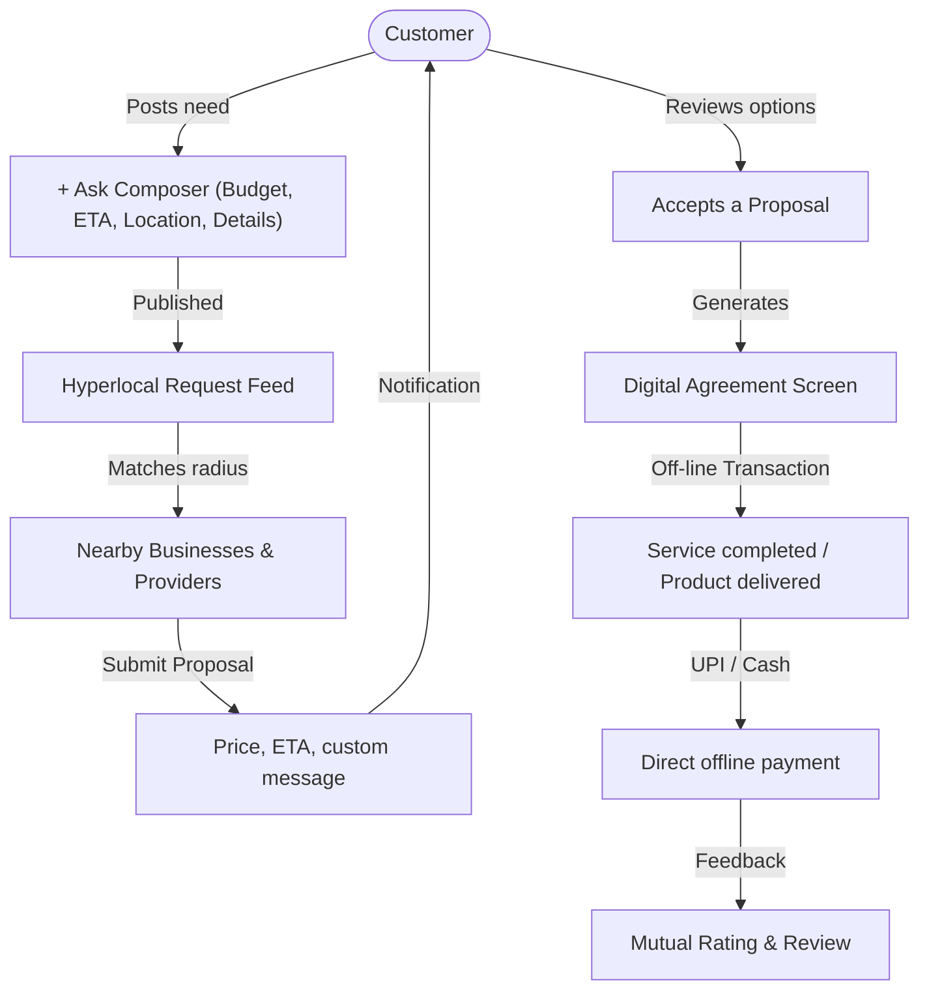

# Hyperlocal Business Pipeline & Operational Model

This report details how **Naya** functions as a hyperlocal three-sided marketplace, covering:
1. How a resident opens and sets up a business.
2. How businesses manage their day-to-day operations.
3. How customers discover and interact with local businesses.
4. The underlying business model and monetization strategy.

---

## 1. Onboarding Pipeline (Opening a Business)

Opening a business in **Naya** is designed to be frictionless for non-tech-savvy owners. Below is the step-by-step pipeline for how a normal person converts their physical shop or skill into a live listing on the app:



### Key Stages in Detail:
* **Role Switcher**: Users register initially under a single phone number. They can wear multiple hats (Customer, Service Provider, Business Owner) using a profile toggle.
* **Geocoding & PostGIS**: Location setup uses Leaflet maps. The coordinates are stored as a PostGIS geography point (`geog`), which is crucial for radius-based search queries later on.
* **Moderation Queue**: To prevent spam, every newly registered business goes into a `PENDING` state. An admin logs in via the Admin Console to review the details and approve the business to go live.

---

## 2. Operations & Management (The Business Console)

Once approved, the business owner gains access to the **Business Console**, their operations dashboard. They can manage daily activity and drive engagement:

| Operational Feature | How it Works | Business Value |
| :--- | :--- | :--- |
| **Catalog Manager** | Add, edit, or delete items, pricing, and descriptions. Group products into custom categories. | Keeps the digital storefront synchronized with physical stock. |
| **Shop Stories** | Upload 24-hour visual updates/posts that appear on nearby users' home feeds. | Micro-marketing tool to share daily specials, fresh arrivals, or active status. |
| **Offers & Promotions** | Create and publish discount coupons (flat/percentage off) linked directly to the catalog. | Attracts budget-conscious users and increases footfall during off-peak hours. |
| **Live Queue & Tokens** | Customers can request a virtual queue token before arrival ("3 ahead, ~25m wait"). | Optimizes walk-ins, avoids crowding in service businesses (salons, clinics). |
| **Interaction Analytics** | Tracks metrics like Profile Views, Phone Calls, and Direction Clicks. | Helps the owner understand their reach and conversion rate within the neighborhood. |

---

## 3. Customer Interaction Pipeline (Hyperlocal Loop)

Customers discover and engage with local businesses through two main paths: **Direct Discovery (Pull)** and the **Request Feed (Push)**.

### Path A: Direct Discovery (Search, Feed, Map)


### Path B: The Request Feed (The Reverse Marketplace)
For cases where a buyer cannot find a product or has a specific custom service request:



> [!NOTE]
> **Offline Settlement by Design**: Cash or UPI transactions settle directly between the customer and business at the time of delivery/service. This keeps transaction friction zero in Phase 1, avoiding payment processing fees and regulatory/compliance hold-ups.

---

## 4. Full Business Model (The monetization strategy)

Naya’s revenue model utilizes a phased strategy to build high neighborhood liquidity before introducing transactional fees.

### Phase 1: Zero-Friction Liquidity (Free)
All features, listings, and customer interactions are free. The primary objective is to drive density—ensuring that in any targeted neighborhood, there is a high ratio of active listings relative to searching residents.

### Phase 2: Hyperlocal Micro-Transactions (Paid Boosts)
Once network density is established, businesses and service providers pay small, UPI-friendly amounts to boost visibility:

```
[Business / Provider] ─── (UPI Micro-payment) ───► [Naya Platform]
                                                          │
          ┌───────────────────┬───────────────────────────┴───────────────────┐
          ▼                   ▼                                               ▼
   [Radius Boost]      [Top of Feed]                                 [Lead/Proposal Boost]
   Extend push alert  Pin shop to top                                Pinned proposal on
   from 5km to 15km   of browse results                              customer's request
```

| Boost Type | Cost (Typical) | Purpose |
| :--- | :--- | :--- |
| **Radius Boost** | ₹199 / launch | Extend launch notification radius from 5 km to 15 km to capture outer-ring traffic. |
| **Top of Feed** | ₹99 / week | Pinned at the top of their business category for high visibility. |
| **Featured on Home** | ₹499 / week | Banner advertisement displayed on the main feed page. |
| **Verified Badge** | ₹299 / year | Reassures customers with a blue checkmark indicating document verification. |
| **Provider Lead Boost** | ₹49 / proposal | Pins a provider's bid to the top of a customer's requested need. |

### Phase 3: Transactional Commissions
Introduce in-app escrow and payment routing (e.g., via Razorpay). The platform charges a **5% to 10% commission** on jobs successfully completed and paid online through the app, offering booking guarantees, mediation, and loyalty points.
