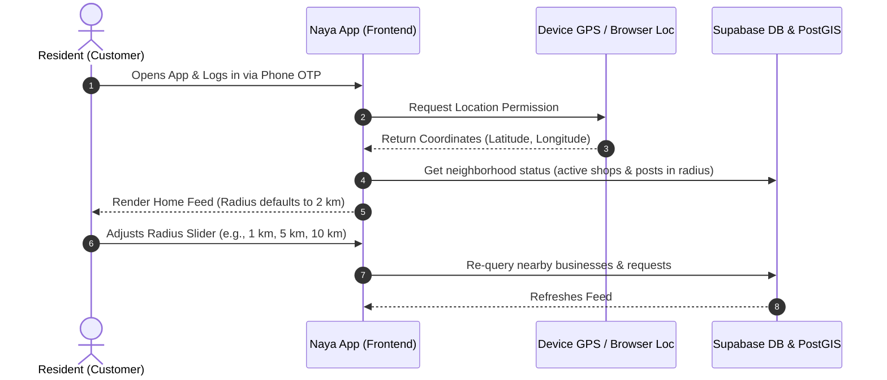
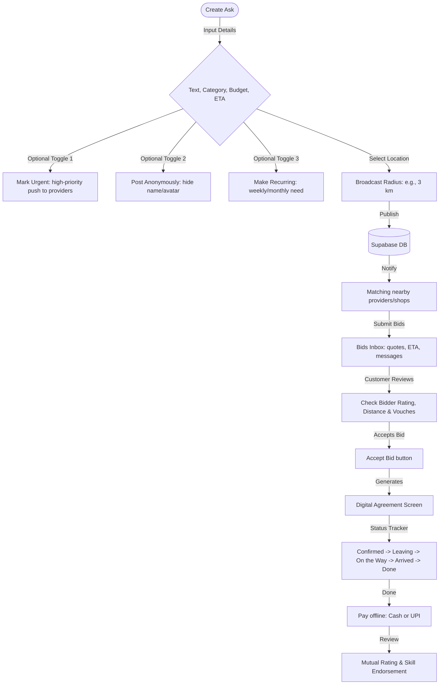

# Customer Pipeline & Neighborhood Social Model

This report details how **Naya** empowers the everyday customer (resident), covering:
1. How a customer accesses the platform and sets their neighborhood boundary.
2. How the hyperlocal "Ask & Bid" reverse marketplace operates.
3. How customers connect with shops, providers, and neighbors (the social layer).
4. The gamified trust and loyalty mechanisms.

---

## 1. Onboarding & Neighborhood Access

When a resident opens **Naya**, they are placed into a local sandbox defined entirely by their physical coordinate. The onboarding is simple:



---

## 2. Hyperlocal Request & Agreement Pipeline (Pillar C)

If a customer cannot find what they need in the business catalog, they broadcast an "Ask." This is the reverse marketplace pipeline:



### The Agreement Loop in Code:
* **`AskCompose.tsx`**: Provides the form to create a request, set a budget (INR), and attach photos.
* **`RequestDetail.tsx`**: Displays the active request, counts "Me Too" neighbors, and lists incoming bidding proposals.
* **`AgreementScreen.tsx`**: A dual-confirm page showing the agreement checklist (terms, offline price) and active progress updates.
* **`RateScreen.tsx`**: A double-blind rating page where the customer reviews the service and endorses specific provider skills (e.g., *Punctual*, *Affordable*).

---

## 3. The Neighborhood Social & Connection Layer

Naya isn't just a directory; it houses a local social network to drive daily engagement. Residents connect with local businesses, providers, and other neighbors in three ways:

### A. The Community Board (`Community.tsx`)
A public noticeboard scoped to the local radius. Neighbors post and comment on:
* **Discussions**: General local chat, recommendations (*"Who serves the best samosas nearby?"*).
* **Lost & Found**: Missing pets, lost keys, found packages.
* **Alerts**: Water outages, electricity maintenance, traffic blocks.
* **Polls**: Group decisions (*"Should we organize a neighborhood cleaning drive?"*).
* **Giveaways**: Giving away unused furniture, books, or toys locally.

### B. Group-Buying & "Me Too" Consolidation
* When a customer posts an Ask (e.g., *"Need a water tanker for my building, budget ₹2000"*), other neighbors can click **"Me Too"** on the feed.
* This consolidates multiple local requests into a single group-buy card, letting providers offer bulk discounts for the same area.

### C. Friends & Public Profiles (`PublicProfile.tsx`)
* **Follow Core Loop**: Users can follow shops and providers. Updates are visible in the "Saved" feed and status stories.
* **Vouches & Badges**: Public profiles display badges earned (e.g., *Helpful Neighbor*, *Early Supporter*) and total vouches received from other verified residents.
* **Share as Card**: Customer and shop profiles can be exported as a clean visual card and shared via WhatsApp or copy-link to friends.

---

## 4. Gamified Trust & Loyalty Model (The Wallet & Leaderboard)

To keep customers active and ensure high-trust interactions, Naya incorporates gamified elements:

```
    [Help Neighbors / Post Reports] ────► Earn Neighborhood Points (XP)
                                                   │
                                                   ▼
                                        [Gamified Leaderboard]
                                   Ranked weekly against neighbors
                                                   │
                                                   ▼
                                       [Achievements & Badges]
                                 Unlocks status & Exclusive Badges
                                                   │
                                                   ▼
                                        [Local Coupon Wallet]
                                  Exchanged for discounts at local shops
```

* **Leaderboard (`Leaderboard.tsx`)**: Ranks local residents by points earned for verified actions (e.g., reporting spam, completing agreements, writing reviews, responding to noticeboard questions).
* **Achievements (`Achievements.tsx`)**: Tracks progress toward milestone challenges like *"First Vouch"*, *"Local Guide"*, or *"Helper Tier 2"*.
* **Wallet (`Wallet.tsx`)**: Stores:
  * **Loyalty Punch Cards**: Digital stamps earned by buying from local shops (e.g., buy 9 coffees, get the 10th free).
  * **Coupon Wallet**: Stores platform-wide and merchant-specific discounts earned via leaderboard achievements.
  * **Offline Settlement Ledger**: Tracks spending and payment balances between neighbors.
