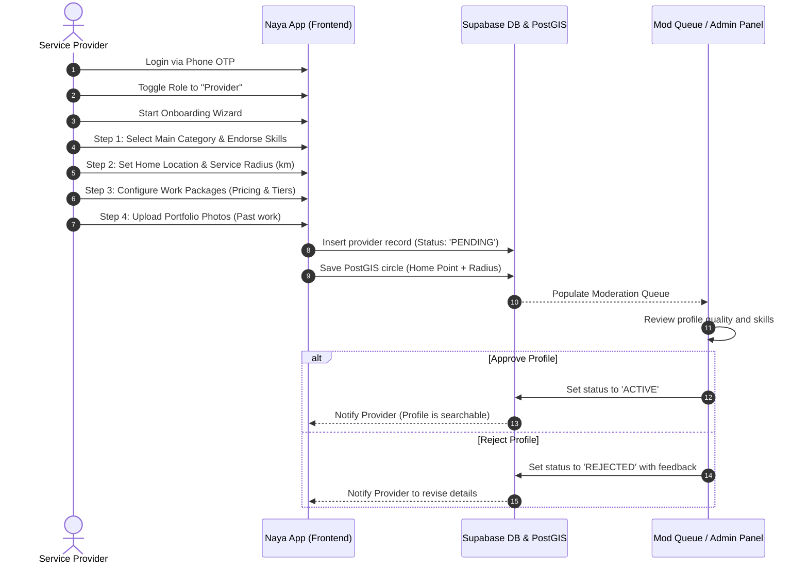
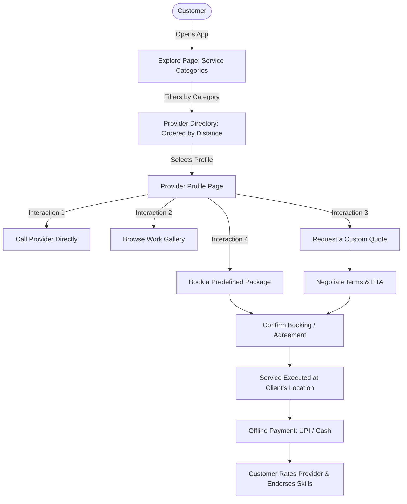
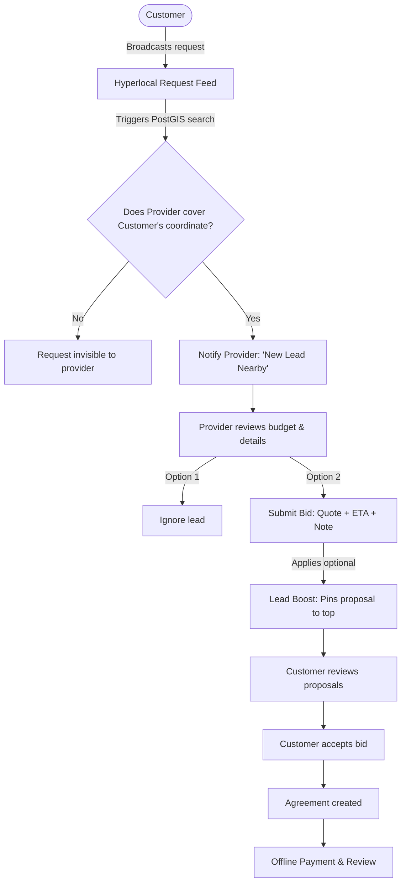

# Service Provider Pipeline & Operational Model

This report details how **Naya** supports independent service providers (such as plumbers, tutors, barbers, makeup artists, and tiffin cooks), covering:
1. How a provider creates and configures their profile.
2. How providers manage their daily operations and availability.
3. How customers discover providers and hire them.
4. The provider-specific monetization and business model.

---

## 1. Provider Onboarding Pipeline

A provider (individual or small team) onboards through a guided setup wizard. Unlike standard directories, providers define not just their address, but a **service radius** (how far they are willing to travel):

### Onboarding Steps:
* **Hyperlocal Geofence**: The provider sets their base location and travel limit (e.g., 5 km). The database creates a radius boundary using PostGIS. They will only be displayed to customers whose coordinates fall within this service circle.
* **Pricing Packages**: Providers set up standardized packages (e.g., *Basic Haircut - ₹200*, *Hair Spa & Wash - ₹600*) so customers have clear cost expectations before booking.

---

## 2. Operations & Console (The Provider Workspace)

Once activated, providers manage their daily activities through the **Provider Console**:

| Operational Feature | How it Works | Provider Value |
| :--- | :--- | :--- |
| **"Available Now" Beacon** | A live toggle indicating they are free *right now* for the next few hours. | Elevates the provider to a dedicated, high-visibility rail on nearby customers' home feeds for immediate jobs. |
| **Portfolio & Work Gallery** | Upload photos of recently completed work (e.g., bridal makeup, repainted rooms). | Serves as visual proof of skill, which directly increases customer conversion. |
| **Packages Editor** | Add, edit, or remove service packages with descriptions, estimated duration, and pricing. | Standardizes services to reduce negotiation time with clients. |
| **Availability Scheduler** | Set regular weekly working hours and holiday dates. | Prevents booking requests during off-hours or busy personal slots. |
| **Leads & Bidding Inbox** | Lists hyperlocal requests broadcasted by customers in their category and area. | Gives providers a central place to submit custom bids (price + ETA + message) for active requests. |

---

## 3. Customer-Provider Interaction Pipeline

Customers can hire providers through two primary flows: **Direct Hiring (Pull)** and **Request Bidding (Push)**.

### Path A: Direct Discovery & Quote Requests

### Path B: Bidding on the Request Feed
When a customer broadcasts a general request (e.g., *"Need a wedding photographer for 3 hours this Sunday"*):

> [!TIP]
> **Skill Endorsements & Vouches**: In addition to standard star ratings, customers can vouch for specific skills (e.g., *"Fast Plumbing"*, *"Great with Kids"*). These tags aggregate on the provider's profile to build targeted reputation.

---

## 4. Provider Monetization Model

Naya prioritizes helping providers secure consistent local jobs before extracting fees:

1. **Phase 1: Free Lead Generation (Current)**
   * Providers receive leads and submit bids for free. 
   * This builds trust, gathers user ratings, and proves the platform's value.

2. **Phase 2: Lead Promotion & Category Placement (Paid)**
   * **Lead Boost (₹49 / proposal)**: Pins the provider's proposal at the very top of the customer's request details, ensuring it is viewed first.
   * **Category Spotlight (₹149 / week)**: Boosts the provider's position in the directory search results for their specific category (e.g., Plumbing).
   * **Verified Provider Badge (₹299 / year)**: Adds a verification checkmark to the profile after verifying identity documents (Aadhaar/License), increasing customer booking rates.
   * **Available Now Rail Placement (₹19 / activate)**: Places the provider on the live instant-hire rail for immediate matching.

3. **Phase 3: Transaction Commissions**
   * Once in-app payments are integrated, Naya secures transactions in escrow and charges a **5% to 8% commission** on completed service jobs, handling invoice generation, scheduling, and service insurance.
