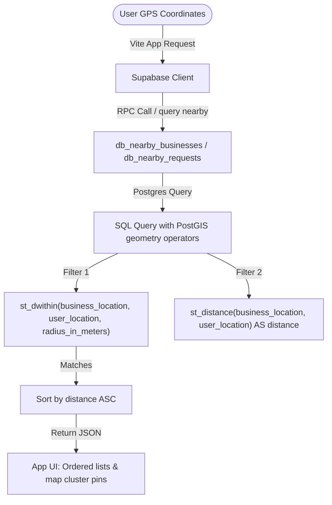
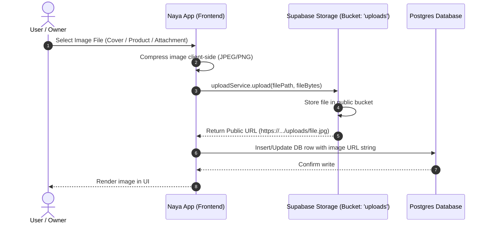
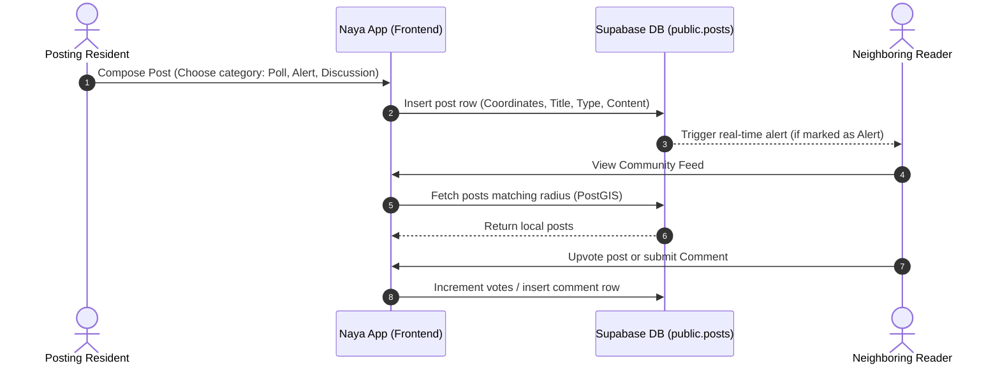
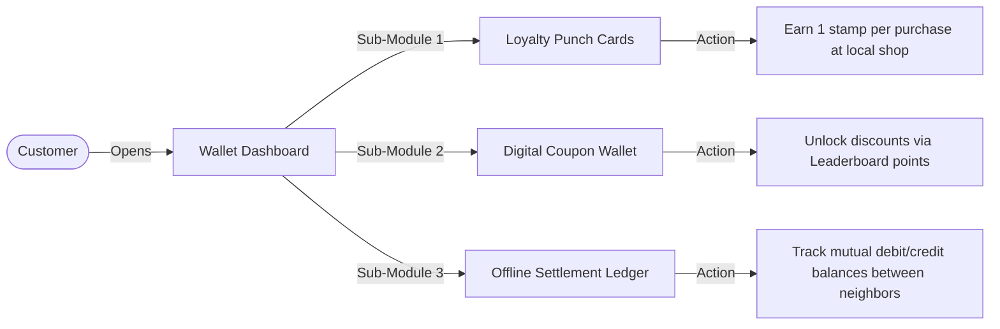

# Naya Core System & Auxiliary Engine Report

This report outlines the remaining core subsystems of the **Naya** architecture:
1. **Hyperlocal Geolocation Engine** (PostGIS distance queries & maps).
2. **Media Storage & Upload Pipeline** (Supabase Storage).
3. **The Local Community Board & Engagement Engine** (Discussions, comments, upvotes).
4. **The Wallet, Loyalty, & Transaction Ledger** (Coupons, punch cards, offline settlements).

---

## 1. Hyperlocal Geolocation Engine

The foundation of Naya is **hyperlocal relevance**. Instead of sorting by country, state, or city, everything is sorted by straight-line distance using PostGIS geography structures:

### Technical Specs:
* **Storage**: Coordinates are stored in the database as `geography(Point, 4326)`.
* **Queries**: Feed fetches use the RPC function `nearby_businesses(lat, lng, radius_meters)`.
* **Map Rendering**: Built using Leaflet and mapped in [MapView.tsx](file:///d:/zetax/name/name/src/screens/MapView.tsx), clustering close proximity pins to maintain readability.

---

## 2. Media Storage & Upload Pipeline

When business owners upload product pictures or users upload request attachments, the assets pass through the following pipeline:

* **Storage Bucket**: Configured as a public bucket named `uploads`.
* **Owner RLS**: Standard users can only write to folder paths matching their `auth.uid()`, preventing cross-user asset tampering.

---

## 3. The Local Community Board & Engagement Engine

The Community noticeboard serves as the daily social feed for the neighborhood, driving regular app sessions:

| Post Category | Purpose | Notification Action |
| :--- | :--- | :--- |
| **Alert** | Safety or local infrastructure issues (e.g. water cuts, local fire). | High-priority instant notification to users within 2 km. |
| **Notice** | Announcements (e.g. local market timings, community events). | Appears in local feed tab. |
| **Poll** | Neighborhood feedback (e.g. *"Should we request a speedbreaker on main road?"*). | Live voting updates synced via Supabase subscription. |
| **Giveaways** | Decluttering and recycling items locally. | Hyperlocal matching to nearby residents. |

---

## 4. Wallet, Loyalty, & Transaction Ledger

Since payments settle offline (Cash/UPI), the **Wallet** acts as the ledger and loyalty aggregator:

### Wallet Functions in Detail:
1. **Loyalty Punch Cards**: Simulates a physical card (e.g., *"Buy 9 Tiffin meals, get the 10th free"*). The shop owner scans a QR or logs a transaction, adding a punch to the customer's card.
2. **Coupon Wallet**: Aggregates verified business promotions and community-earned discounts in one place for checkout presentation.
3. **Offline Settlement Ledger**: Keeps track of outstanding cash tabs between trusted community members (e.g., *"Plumber completed repair, tab logged as ₹500 pending"*). Once UPI/cash is exchanged, both parties mark the ledger item as settled.
