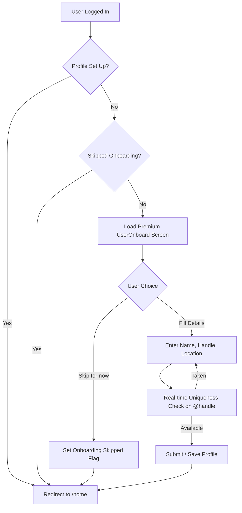

# High-Level & Low-Level Design: Optional, Premium Onboarding & Unique Handle Setup

This document provides the design specification for an optional, highly engaging, and premium onboarding experience that prompts users to complete their profile (with a unique username/alias) upon login, allowing them to skip if desired. 

---

## 1. High-Level Design (HLD)

### 1.1 Objective & Requirements
- **Optional Flow**: Onboarding is no longer forced. Users can skip the profile setup and go directly to `/home`. A skip state is tracked to prevent nagging.
- **Unique Handle Verification**: Users must be able to choose a public username (`@alias`) which is verified as globally unique in the database in real-time.
- **Premium, Captivating Visuals**: The first-time landing experience must be visually stunning, featuring glassmorphic cards, smooth transitions, a live interactive card preview, and premium styling.

### 1.2 User Flow



---

## 2. Database & API Design (LLD)

### 2.1 Database Constraints
To enforce global uniqueness of public handles, a database unique constraint is required on the `users` table's `alias` column.
```sql
ALTER TABLE users ADD CONSTRAINT unique_user_alias UNIQUE (alias);
```

### 2.2 Uniqueness Checking Service
We will expose a new method in `src/services/userService.ts` to check if a specific alias is already claimed.

```typescript
// src/services/userService.ts
async checkAliasUnique(alias: string): Promise<boolean> {
  const sb = getSupabase();
  const uid = await currentUserId();
  const { data, error } = await sb
    .from("users")
    .select("id")
    .eq("alias", alias)
    .neq("id", uid || "") // Exclude current user in case they are re-editing
    .maybeSingle();

  if (error) throw error;
  return !data; // Returns true if unique/available, false if taken
}
```

---

## 3. Frontend & UI Design (LLD)

### 3.1 Routing & Bypass Flow (`src/App.tsx`)
Modify `needsOnboard` to respect `localStorage` bypass:
```typescript
const needsOnboard = 
  isAuthed && 
  user.id && 
  (!user.name || user.name === "New user") && 
  localStorage.getItem("onboarding_skipped") !== "true" && 
  location.pathname !== "/auth/onboard";
```

---

### 3.2 Redesigned Premium "Welcome Card" & Live Profile Card

To deliver a jaw-dropping first impression, we replace the basic onboarding screen with a dynamic workspace consisting of two main panels:
1. **Interactive Form Panel**: Inputs for full name, unique handle, avatar, and alert radius.
2. **Real-time Live Profile Preview**: A floating 3D-styled member badge/ID card showing exactly what their profile looks like as they type.

#### Visual Elements:
- **Glassmorphic ID Card**: A background with `backdrop-filter: blur(24px)`, subtle gradients, and glowing borders.
- **Status Indicator for Handles**: A live badge next to the username input:
  - 🔄 *Checking...* (Yellow/Blue spinner)
  - ✅ *Handle available!* (Vibrant green background)
  - ❌ *Handle already taken* (Warm red background)

---

### 3.3 Visual Layout Specification (`src/screens/auth/UserOnboard.tsx`)

#### New State Variables:
```typescript
const [aliasAvailable, setAliasAvailable] = useState<boolean | null>(null);
const [checkingAlias, setCheckingAlias] = useState(false);
```

#### Debounced Uniqueness Check Hook:
```typescript
useEffect(() => {
  if (alias.trim().length < 3) {
    setAliasAvailable(null);
    return;
  }
  
  setCheckingAlias(true);
  const timer = setTimeout(async () => {
    try {
      const isUnique = await userService.checkAliasUnique(alias.trim().toLowerCase());
      setAliasAvailable(isUnique);
    } catch {
      setAliasAvailable(null);
    } finally {
      setCheckingAlias(false);
    }
  }, 450); // Debounce to prevent database spamming

  return () => clearTimeout(timer);
}, [alias]);
```

#### Skippable Action:
```typescript
const handleSkip = async () => {
  localStorage.setItem("onboarding_skipped", "true");
  // Set fallback name to prevent db constraint failures if blank
  if (!user.name || user.name === "New user") {
    try {
      await userService.update({ name: "Neighbor" });
    } catch (e) {
      console.warn("Soft update failed", e);
    }
  }
  await refreshUser();
  nav("/home", { replace: true });
};
```

---

### 3.4 Premium Live Profile Card Layout (React/JSX)

This visual preview card floats alongside the form and updates instantly, providing a gamified feeling to setting up their identity:

```tsx
<div 
  className="profile-preview-card"
  style={{
    background: "linear-gradient(135deg, rgba(255, 255, 255, 0.7), rgba(255, 255, 255, 0.3))",
    backdropFilter: "blur(20px)",
    borderRadius: 24,
    border: "1px solid rgba(255, 255, 255, 0.4)",
    padding: 20,
    boxShadow: "0 20px 40px rgba(0, 0, 0, 0.08)",
    width: "100%",
    maxWidth: 320,
    margin: "0 auto 24px",
    display: "flex",
    flexDirection: "column",
    alignItems: "center",
    textAlign: "center"
  }}
>
  {/* Avatar Display */}
  <div style={{
    width: 80, height: 80,
    borderRadius: "50%",
    background: "linear-gradient(135deg, var(--brand-100), var(--brand-200))",
    display: "flex", alignItems: "center", justifyContent: "center",
    fontSize: 40,
    marginBottom: 14,
    boxShadow: "0 10px 20px rgba(124,58,237,0.15)"
  }}>
    {avatar || "👋"}
  </div>

  {/* Live Name & Handle */}
  <div style={{ fontWeight: 800, fontSize: 18, color: "var(--ink-900)" }}>
    {name || "Your Name"}
  </div>
  <div style={{ fontWeight: 600, fontSize: 13, color: "var(--brand-600)", marginTop: 2 }}>
    {alias ? `@${alias}` : "@handle"}
  </div>

  {/* Location / Area Info */}
  <div style={{ display: "flex", alignItems: "center", gap: 4, marginTop: 12, fontSize: 11, fontWeight: 700, color: "var(--ink-500)", textTransform: "uppercase", letterSpacing: 0.5 }}>
    <span>📍</span> {areaInput || "Not Set"}
  </div>
</div>
```

---

## 4. Skip Controls UI
A subtle, clean top header bar will be added to the onboarding screen to allow optional skipping:

```tsx
<div style={{ display: "flex", justifyContent: "space-between", alignItems: "center", width: "100%", padding: "16px 20px" }}>
  <div style={{ fontWeight: 800, fontSize: 16, color: "var(--brand-700)" }}>STRYT</div>
  <button 
    onClick={handleSkip} 
    style={{
      background: "rgba(255,255,255,0.7)",
      border: "1px solid var(--ink-200)",
      borderRadius: 14,
      padding: "8px 16px",
      fontSize: 12,
      fontWeight: 700,
      color: "var(--ink-600)",
      cursor: "pointer",
      backdropFilter: "blur(8px)",
      transition: "all 0.2s"
    }}
  >
    Skip Setup
  </button>
</div>
```
