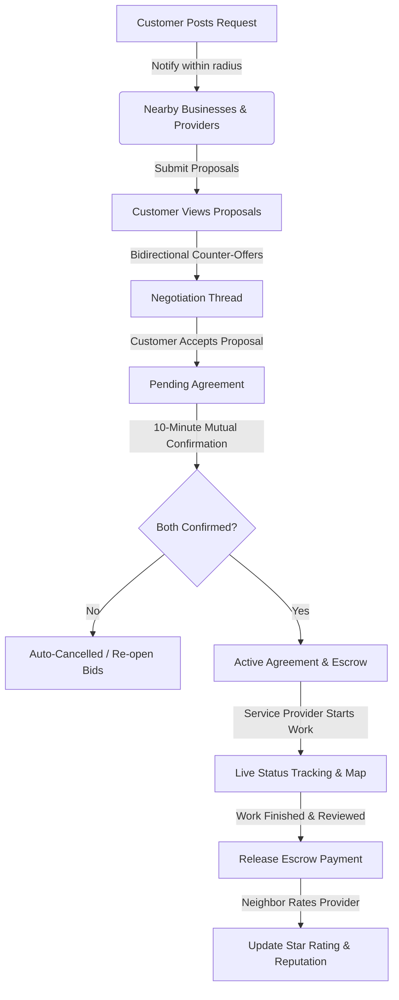

# STRYT — Your Street. Your People.

[](https://github.com)
[](https://react.dev)
[](https://www.typescriptlang.org)
[](https://supabase.com)
[](https://capacitorjs.com)

**STRYT** is a hyperlocal community marketplace and live storefront app designed to connect neighbors, customers, local businesses, and independent service providers. Warm, trustworthy, fast, and decidedly non-corporate, STRYT acts as the digital heartbeat of your street.

---

## 🗺️ The Core Vision

Hyperlocal, real-time coordination shouldn't require complex enterprise software. STRYT matches consumers with local providers and shops instantly by organizing interactions into three simple zones:
1. **Right Now (Live Pulse):** Check if a business is open, see wait times in a queue, check provider availability, or view active local offers.
2. **Decide (Credibility & Estimates):** Trust receipts, neighborhood vouches, and transparent up-front pricing estimates.
3. **Act (Direct Action):** Book slots, join a queue, chat with one-tap pre-filled questions, or pay securely.

---

## 👥 The "Hats" Model (One Login, Multiple Contexts)

In STRYT, one login equals one account, but a user can wear different "hats" by toggling their context:

| Role | Role Name | Context Flag | Capabilities |
| :--- | :--- | :--- | :--- |
| **Customer (A)** | Neighbor | `customer` | Browse, post requests, make bookings, join queues, submit counters, chat, rate businesses. |
| **Business (B)** | Local Shop | `business` | Set up a storefront/catalog, manage live queues, verify appointments, offer loyalty stamps. |
| **Provider (B)** | Freelancer | `provider` | Showcase portfolio work reels, offer instant cost estimates, set available booking slots. |
| **Admin** | Moderator | — | Manage user verification, resolve transaction disputes, release escrowed payments. |

---

## ⚡ Core Feature Loops & Flows

### 🔄 Flow 1: Hyperlocal Service Requests (Marketplace Loop)
When a neighbor needs something done, they don't hunt through directories—they post a request to the neighborhood broadcast.


### 📅 Flow 2: Smart Appointments & Bookings
Direct, friction-free booking against storefront menus or provider catalogs:
* **Slot Selection:** Providers expose available slots, and businesses post catalog items. Customers select slots directly from their profiles.
* **1-Booking-Per-Day Guard:** Prevents slot hoarding, keeping access open for all neighbors.
* **Verification & Settlement:** If offline UPI payment is used, customers submit transaction verification, and businesses verify payouts inside their console.

### 👥 Flow 3: Live Queuing & Walk-ins
Turning storefront wait times into digital convenience:
* **Live Storefront Pulse:** Under the storefront hero, customers see wait times, e.g. `🟢 Open · 👥 3 in queue (~18 min)`.
* **Join Remotely:** Customers join the queue digitally and receive status notifications.
* **Walk-in Tickets:** Businesses can register walk-ins without accounts to keep the digital queue counter perfectly accurate.

---

## 🎨 Design & UX Aesthetics

STRYT is crafted to feel like a high-end, premium native app, focusing heavily on micro-interactions, responsive maps, and warm colors:
* **Warm Dusk Color Palette:** Built using custom CSS variables (no Tailwind/UI libraries). Features violet-purple (`--brand-500 #8b47f5`) and gold-amber accents (`--accent-500 #ff9500`) set against light, tinted neutral backgrounds.
* **Mobile-First App Shell:** Optimized for touch interactions inside a centered `480px` phone shell (`.app-shell`).
* **Phosphor Icons:** Consistent, beautiful iconography mapped through `@/components/Icons`.
* **Zero is Not Data Rule:** We don't display empty metrics (like "0 stars" or "0 km"). If data is missing or empty, it displays as `"New"` or `"Nearby"`, or is hidden altogether to maintain an honest, high-fidelity experience.

---

## 🛠️ Technology Stack & Architecture

STRYT is built using a modern, lightweight, reactive architecture:

```
[ Vite + TypeScript Frontend ] <--- Realtime Sync ---> [ Supabase Postgres + RLS ]
            |                                                    |
   [ Capacitor Wrapper ]                                [ Storage / Edge Funcs ]
            |
    [ Android Build ]
```

* **Frontend:** React 18, Vite, TypeScript, React Router v6.
* **Backend (Supabase):** PostgreSQL with Row Level Security (RLS) policies, Realtime Database replication, Edge Functions, and triggers.
* **Maps & Geolocation:** Leaflet and `react-leaflet` for mapping request radiuses and tracking providers.
* **Mobile Compilation:** CapacitorJS bridges the web bundle to native Android code.

---

## 📂 Core Repository Map

To orient yourself in the codebase:
* [src/main.tsx](file:///d:/zetax/name/STRYT/src/main.tsx) — Entry point mounting the app.
* [src/App.tsx](file:///d:/zetax/name/STRYT/src/App.tsx) — Central route registry (`react-router-dom`) and auth-guarded layouts.
* [src/store.tsx](file:///d:/zetax/name/STRYT/src/store.tsx) — Global state provider (`useApp()`) managing user authentication, bookmarks, and local social state.
* [src/index.css](file:///d:/zetax/name/STRYT/src/index.css) — Hand-crafted CSS tokens, variables, typography, and utility classes.
* [capacitor.config.ts](file:///d:/zetax/name/STRYT/capacitor.config.ts) — Mobile bridge configurations.
* [supabase/](file:///d:/zetax/name/STRYT/supabase) — Database migrations, schemas, and helper edge functions.
