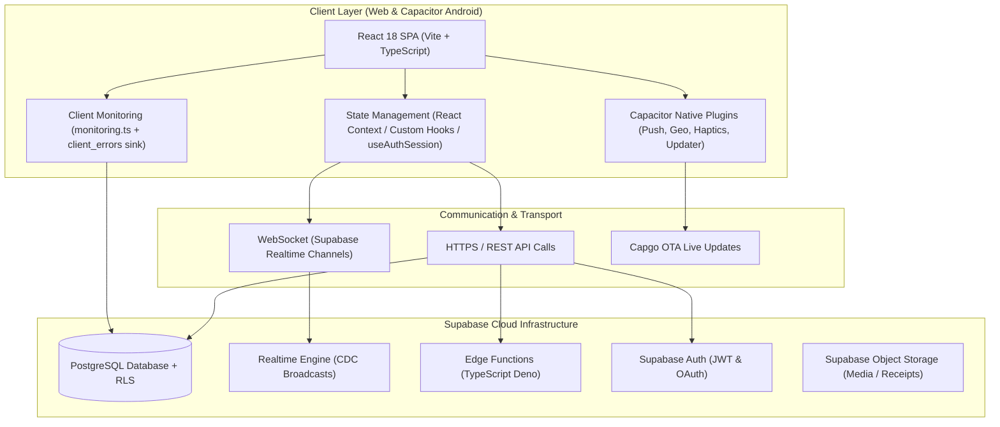

# STRYT — System Architecture & Technical Stack Analysis

> **Document Location:** `app-analysis/01_ARCHITECTURAL_ANALYSIS.md`  
> **Scope:** Frontend, Backend, State Management, Database, Mobile Wrapper, and Deployment Architecture.

---

## 1. Executive Summary of Architecture

STRYT is constructed as a high-performance, reactive single-page web application (SPA) wrapped in a native Capacitor shell for Android mobile deployment. The core architectural philosophy relies on a **serverless, realtime backend** (Supabase Postgres) combined with a **client-heavy, stateful presentation layer** (React 18 + TypeScript + Vite).



---

## 2. Core Technological Components

### A. Frontend Stack
* **Framework:** React 18.3 with functional components and modern hooks.
* **Build System:** Vite 5.4 providing fast HMR and optimized production bundling with custom CSS token isolation (`scripts/check-hardcoded-colors.js`).
* **Type System:** TypeScript 5.6 for strict compile-time safety across screens, features, and database typings.
* **Routing:** `react-router-dom` v6 managing customer, business, provider, and admin viewports.
* **Iconography & Styling:** Pure Vanilla CSS using custom CSS design tokens (`--brand-500`, `--accent-500`) and `@phosphor-icons/react` / `lucide-react`.

### B. Backend & Persistence Layer
* **Database:** Supabase PostgreSQL with schema definitions, triggers, and migrations located in `supabase/`.
* **Data Isolation:** Row Level Security (RLS) policies enforcing multi-tenant boundaries between neighbors, storefront owners, and service providers.
* **Realtime Communication:** Postgres Change Data Capture (CDC) via WebSockets streaming live request bids, queue updates, and message threads to connected clients.
* **Edge Compute:** Supabase Edge Functions handling secure server-side logic (payment webhooks, radius broadcasts, notification triggers).

### C. Mobile Native & PWA Infrastructure
* **Native Wrapper:** Capacitor 8 (`@capacitor/core`, `@capacitor/android`) bridging web UI to Android OS APIs.
* **Over-the-Air (OTA) Updates:** `@capgo/capacitor-updater` enabling live production updates without requiring manual app store re-submissions.
* **PWA Capability:** `vite-plugin-pwa` and Workbox service workers (`sw.js`) supporting precaching, offline capability, and background sync.

---

## 3. State & Data Flow Architecture

The application implements a decoupled context and feature-hook state pattern:

```
[ Component View Layer ]
        │
        ▼
[ Custom Feature Hooks (useWeather, useAuthSession, useLocation) ]
        │
        ▼
[ Global App Store / Context (src/store.tsx) ]
        │
        ▼
[ Supabase Client SDK & Realtime Listener Subscriptions ]
        │
        ▼
[ Supabase Postgres Database ]
```

### Key State Domains:
1. **Auth & Identity State (`useAuthSession.ts`):** Manages user session tokens, current active "hat" role (`customer` | `business` | `provider`), profile verification status, and local storage persistence.
2. **Global Application State (`src/store.tsx`):** Manages active bookmarks, global modal visibility, current spatial location, and local request drafts.
3. **Realtime Domain State (`src/lib/` & feature screens):** Listens to live Postgres channels for real-time queue position changes, bid proposals, and instant chat messages.

---

## 4. Architectural Strengths & Bottlenecks

### Strengths:
1. **Low Latency Realtime Updates:** Instant push of queue numbers and service bids without expensive backend polling.
2. **Built-in Resilient Error Handling:** `src/lib/monitoring.ts` guarantees client crash visibility by intercepting global JS errors and unhandled promise rejections into a deduplicated Supabase table (`client_errors`).
3. **Clean Seam for Native & Web:** Single unified codebase compiles to web SPA, PWA, and Capacitor Android package.

### Recommended Architectural Improvements:
1. **State Partitioning:** Transition large global state objects in `src/store.tsx` into modular Zustand slices to prevent unnecessary component re-renders across disparate UI trees.
2. **Query Caching Layer:** Integrate TanStack Query (React Query) to handle automatic deduplication, background revalidation, and optimistic UI updates for catalog browsing and booking availability.
3. **Database Indexing Strategy:** Ensure geospatial index (`GIST` on `geography(POINT)`) and compound indexes on `(user_id, status)` exist in Supabase migrations to support sub-50ms query response times under load.

---
*Report compiled for STRYT Architectural Review.*
