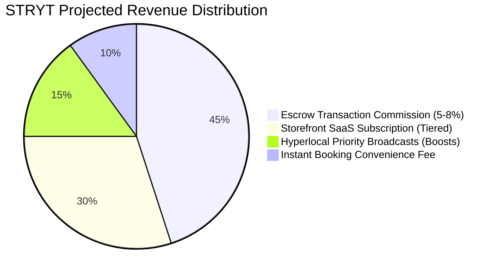

# STRYT — Business Potential, Market Strategy & Monetization Analysis

> **Document Location:** `app-analysis/02_BUSINESS_POTENTIAL_AND_MONETIZATION.md`  
> **Scope:** Hyperlocal Market Opportunity, "Hats" Business Model, Revenue Channels, Unit Economics, and Growth Loops.

---

## 1. Market Opportunity & Problem Statement

### The Hyperlocal Gap
Local commerce and neighborhood service discovery suffer from extreme fragmentation:
* **Directory Overload:** Existing directories (Yelp, Google Maps, Justdial) offer static listings but lack real-time operational state (e.g., *Is the salon open right now? How long is the wait time?*).
* **High Intermediary Fees:** Enterprise booking and delivery platforms charge local merchants 15% - 30% commission per transaction.
* **Friction in Micro-Services:** Independent neighborhood service providers (plumbers, tutors, handymen) lack simple, non-corporate tools to negotiate pricing, confirm slots, and collect digital payments.

### The STRYT Solution
STRYT serves as the **digital heartbeat of the street**, organizing real-time neighborhood interactions into three actionable zones:
1. **Right Now (Live Pulse):** Real-time storefront queue times, live open status, active provider availability, and immediate broadcast deals.
2. **Decide (Credibility & Estimates):** Neighborhood trust vouches, upfront cost estimates, and verified community receipts.
3. **Act (Direct Action):** One-tap requests, bidirectional price counter-offers, digital queue tickets, and escrow-backed payments.

---

## 2. The "Hats" Ecosystem Model

STRYT eliminates multi-account confusion by employing a unified **One Account, Multiple Hats** architecture:

```
                  ┌──────────────────────────────┐
                  │    Unified User Account      │
                  │   (Single Auth Credentials)  │
                  └──────────────┬───────────────┘
                                 │
         ┌───────────────────────┼───────────────────────┐
         ▼                       ▼                       ▼
┌──────────────────┐   ┌──────────────────┐   ┌──────────────────┐
│ Neighbor (Hat A) │   │ Shop Owner (Hat B)│  │ Freelancer(Hat B)│
│  - Browse Stores │   │  - Store Catalog │   │  - Service Reel  │
│  - Post Requests │   │  - Live Queue    │   │  - Bid Proposals │
│  - Join Queues   │   │  - Offer Stamps  │   │  - Slot Bookings │
│  - Pay & Rate    │   │  - Verify UPI    │   │  - Cost Estimates│
└──────────────────┘   └──────────────────┘   └──────────────────┘
```

---

## 3. Revenue & Monetization Streams

STRYT achieves high capital efficiency through a diversified multi-stream revenue model:



### A. Marketplace Escrow Commission (45% of Revenue)
* **Mechanism:** When a customer accepts a service proposal (e.g., home repair, tutoring), payment is placed in escrow. Upon successful job completion and customer verification, STRYT retains a **5% - 8% platform fee** before releasing funds to the provider.
* **Value Prop:** Eliminates non-payment risk for service providers while protecting customers against incomplete work.

### B. Merchant Storefront Subscription (30% of Revenue)
* **Free Tier:** Basic profile, manual open/close toggle, up to 5 catalog items.
* **Pro Storefront ($19 - $49/mo):** Digital live queue management, walk-in ticket registration, unlimited catalog items, automated customer loyalty stamp programs, and neighborhood analytics.
* **Enterprise Local ($99/mo):** Multi-location management, API integrations, priority customer support, and custom branded QR table/counter codes.

### C. Hyperlocal Priority Broadcasts & Ad Boosts (15% of Revenue)
* **Mechanism:** Local shops can pay micro-fees ($2 - $10) to broadcast flash deals, happy-hour discounts, or urgent appointment slots to app users within a targeted radius (1km - 5km).
* **ROI Metric:** Pay-per-engagement or pay-per-converted broadcast request.

### D. Instant Booking Convenience Fee (10% of Revenue)
* **Mechanism:** Flat convenience fee ($0.50 - $1.00) charged to customers for instant queue jump options or guaranteed high-demand weekend booking slots.

---

## 4. Total Addressable Market (TAM / SAM / SOM)

Assuming initial deployment across major urban/semi-urban commercial hubs in India & Emerging Markets:

```
┌─────────────────────────────────────────────────────────────┐
│ Total Addressable Market (TAM): $50B+                      │
│ Global Hyperlocal E-Commerce & Service Market               │
└──────────────────────────────┬──────────────────────────────┘
                               │
┌──────────────────────────────▼──────────────────────────────┐
│ Serviceable Addressable Market (SAM): $4.2B                │
│ Tier 1 & Tier 2 Urban Local Service & Merchant Commerce    │
└──────────────────────────────┬──────────────────────────────┘
                               │
┌──────────────────────────────▼──────────────────────────────┐
│ Serviceable Obtainable Market (SOM): $120M                   │
│ Initial Penetration across Top 10 High-Density Cities        │
└─────────────────────────────────────────────────────────────┘
```

---

## 5. Growth Loops & Network Effects

STRYT relies on two self-reinforcing organic growth flywheels:

### Flywheel 1: The Merchant-Queue Viral Loop
```
Shop installs STRYT QR Code at Counter
      │
      ▼
Walk-in Customers Scan to Join Digital Queue
      │
      ▼
Customer Installs App to Track Wait Time Remotely
      │
      ▼
Customer Discovers Nearby Shops & Service Broadcasts (Retained User)
```

### Flywheel 2: The Request-Bid Community Loop
```
Neighbor Posts Local Service Request (e.g., Plumbing)
      │
      ▼
System Alerts Local Providers in 3km Radius
      │
      ▼
Providers Submit Proposals & Counter-Offers
      │
      ▼
Completed Job Earns Public Trust Receipt & Neighborhood Vouch
      │
      ▼
Provider Invites Fellow Service Colleagues to Join Platform
```

---

## 6. Key Business Metrics (KPIs) to Track

To measure long-term enterprise value:
1. **Hyperlocal Density Index (HDI):** Active merchants & service providers per square kilometer.
2. **Request Fulfillment Rate (RFR):** Percentage of broadcast requests resulting in an accepted bid within 15 minutes.
3. **Queue Utilization Rate (QUR):** Percentage of daily walk-ins registered through STRYT queue tickets.
4. **Gross Merchandise Value (GMV):** Total dollar value of escrowed service agreements + storefront transactions.
5. **Customer Acquisition Cost (CAC) vs. LTV:** Target LTV:CAC ratio of > 4:1 driven by organic QR counter adoption.

---
*Report compiled for STRYT Business Strategy & Commercial Planning.*
