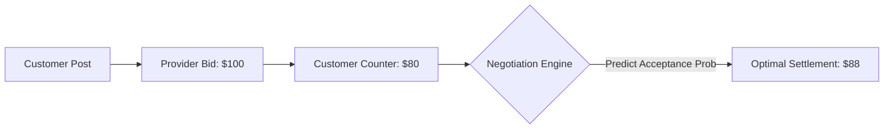

# STRYT — Data & Algorithms Specification

> **Document Location:** `app-analysis/03_DATA_AND_ALGORITHMS_SPECIFICATION.md`  
> **Scope:** Geospatial Matching, Queuing Theory, Decayed Trust Scoring, Negotiation Analysis, and Business Analytics Models.

---

## 1. Executive Summary

Data algorithms form the backbone of STRYT's real-time matching, wait-time precision, neighborhood trust, and predictive commercial analytics. This document details the core mathematical formulations, algorithmic logic, and machine learning models specified for implementation within STRYT.

---

## 2. Real-Time Operational & Spatial Algorithms

### A. Geospatial Matching & Radial Distance Decay

To broadcast requests to providers within a dynamic radius without overloading distant merchants, STRYT uses the **Haversine Formula** / **PostGIS ST_DWithin** with exponential distance decay weighting.

#### Haversine Formula (Great-Circle Distance):
\[
d = 2r \arcsin \left( \sqrt{ \sin^2\left(\frac{\Delta \phi}{2}\right) + \cos(\phi_1)\cos(\phi_2)\sin^2\left(\frac{\Delta \lambda}{2}\right) } \right)
\]
Where \(\phi\) is latitude, \(\lambda\) is longitude, and \(r = 6371\text{ km}\).

#### Spatial Notification Score Algorithm:
\[
S_{\text{match}}(p, r_{\text{req}}) = w_{\text{cat}} \cdot I(\text{category}) \times \exp\left( -\alpha \cdot \frac{d(p, r_{\text{req}})}{R_{\text{max}}} \right) \times \left( \beta \cdot T_p + (1-\beta) \cdot R_p \right)
\]
* \(d(p, r_{\text{req}})\): Geodesic distance between provider \(p\) and request location.
* \(R_{\text{max}}\): Maximum notification radius (e.g., 5km).
* \(T_p\): Decayed Provider Trust Score \([0, 1]\).
* \(R_p\): Response rate score based on past 30 days \([0, 1]\).
* \(\alpha, \beta\): Tuning parameters (\(\alpha = 1.5, \beta = 0.6\)).

---

### B. Dynamic Queue Wait-Time Estimation Model

Storefront queue wait times are calculated using an adaptation of **Single-Server / Multi-Server Queuing Theory (\(M/M/c\) Model)** combined with exponential moving average (EMA) of historical service durations.

```
       Active Queue (Length N)
 ┌───┐   ┌───┐   ┌───┐   ┌───┐
 │ 4 │──►│ 3 │──►│ 2 │──►│ 1 │──► [ Storefront Service (Servers c) ]
 └───┘   └───┘   └───┘   └───┘               │
   ▲                                         ▼
   │                                  Service Duration (S)
   └──────── Digital / Walk-in Ticket     (EMA Smoothed)
```

#### Estimated Wait Time (\(\hat{W}_q\)):
\[
\hat{W}_q = \frac{N_{\text{ahead}}}{c} \times \bar{S}_{\text{EMA}} + W_{\text{buffer}}
\]
Where:
* \(N_{\text{ahead}}\): Number of customers ahead in queue (digital + walk-in tickets).
* \(c\): Number of active service counters/servers.
* \(\bar{S}_{\text{EMA}}\): Smoothed mean service duration updated per completed ticket:
\[
\bar{S}_{\text{EMA}}^{(t)} = \gamma \cdot S_{\text{observed}}^{(t)} + (1 - \gamma) \cdot \bar{S}_{\text{EMA}}^{(t-1)} \quad (\text{with } \gamma = 0.2)
\]

---

### C. Decayed Bayesian Reputation & Trust Algorithm

To prevent review manipulation and reward consistent performance, STRYT calculates provider trust using a **Time-Decayed Bayesian Mean** weighted by transaction verification.

#### Decayed Rating Formulation:
\[
R_{\text{decayed}} = \frac{\sum_{i=1}^{M} w_i \cdot r_i \cdot v_i}{\sum_{i=1}^{M} w_i \cdot v_i}
\]
Where:
* \(r_i \in \{1, 2, 3, 4, 5\}\): Rating given in review \(i\).
* \(v_i \in \{1.0, 1.5\}\): Verification weight (\(1.5\) if escrow-settled transaction; \(1.0\) if unverified).
* \(w_i = \exp(-\lambda \cdot \Delta t_i)\): Time decay factor where \(\Delta t_i\) is age in days and \(\lambda = \frac{\ln(2)}{180}\) (180-day half-life).

#### Final Adjusted Trust Score (\(T_p\)):
\[
T_p = \frac{C \cdot m + \sum (w_i r_i v_i)}{C + \sum (w_i v_i)}
\]
* \(m = 4.2\) (Prior global mean rating).
* \(C = 10\) (Prior weight confidence threshold).

---

## 3. Business Potential & Predictive Analytics Algorithms

### A. Customer Lifetime Value (CLV / LTV) — BG/NBD Model

To predict future monetary value of repeat neighbors and businesses, the **Beta-Geometric / Negative Binomial Distribution (BG/NBD)** model predicts repeat transaction frequency:

\[
E[X(t) \mid x, t_x, T] = \frac{a + x}{b + T} \times \frac{1 - \left( \frac{b + T}{b + T + t} \right)^{r + x} }{1 + \frac{a}{b + r - 1} \left( \frac{b + T}{b + T + t_x} \right)^{r + x} }
\]
* \(x\): Number of repeat bookings/transactions.
* \(t_x\): Recency (time of last transaction).
* \(T\): Customer tenure.
* Combined with **Gamma-Gamma Model** to calculate total expected monetary LTV over 12 months.

---

### B. Churn Prediction & Survival Analysis

To spot declining customer engagement before churn occurs:
* **Cox Proportional Hazards Model:** Identifies risk factors (e.g., failed negotiations, long queue wait times, zero nearby active providers).
* **Survival Function:**
\[
S(t \mid X) = S_0(t)^{\exp(\beta_1 X_1 + \beta_2 X_2 + \dots + \beta_p X_p)}
\]
Triggers automated retention offers (e.g., broadcast credit discount) when \(S(t) < 0.40\).

---

### C. Dynamic Negotiation & Counter-Offer Analytics

Analyzes proposal negotiation threads to determine optimal bid acceptance windows:



* **Logistic Regression Acceptance Model:**
\[
P(\text{Acceptance}) = \frac{1}{1 + \exp\left(-\left(\beta_0 + \beta_1 \cdot \frac{\text{Bid}}{\text{Estimate}} + \beta_2 \cdot \Delta \text{Counter} \right)\right)}
\]

---

## 4. Algorithmic Implementation Architecture

```
                               ┌───────────────────────────┐
                               │  PostgreSQL / PostGIS     │
                               │  - ST_DWithin (Spatial)   │
                               │  - Triggers & Materialized│
                               └─────────────┬─────────────┘
                                             │
                                             ▼
┌───────────────────────────┐  ┌───────────────────────────┐
│ Supabase Edge Functions   │  │ Client Analytics Engine   │
│ - Queue EMA recalculation │◄─┤ - Local distance filter   │
│ - Trust Score updates     │  │ - SHAP feature tracking   │
│ - Churn Risk alerts       │  │ - Micro-interaction metrics│
└───────────────────────────┘  └───────────────────────────┘
```

---
*Specification compiled for STRYT Data Science & Engineering Team.*
