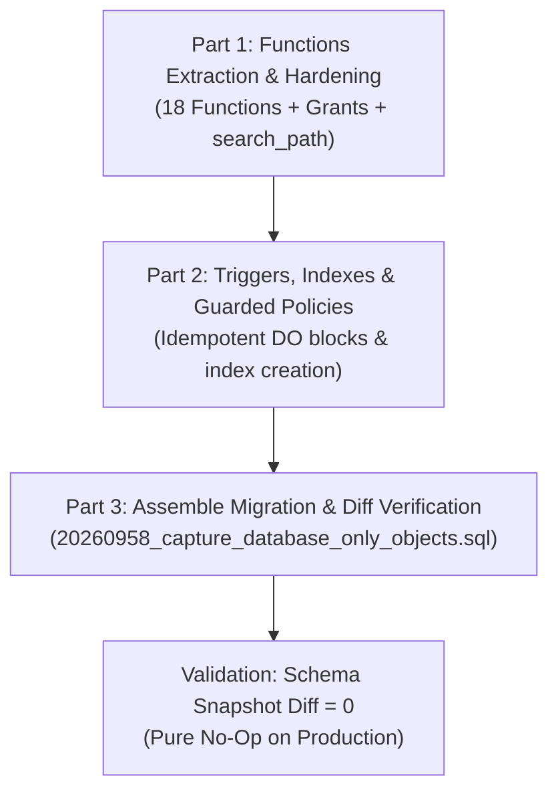

# STRYT Database: W2 Execution Plan & Architecture Document

**Document:** W2 Execution Plan  
**Target Project:** `gnswxlfmcwyhmzlfipql` ("Name", ap-northeast-1)  
**Parent Reference:** [`docs/database/HANDOFF.md`](file:///d:/zetax/name/STRYT/docs/database/HANDOFF.md)  
**Baseline Document:** [`docs/database/DRIFT_BASELINE_2026-09-11.md`](file:///d:/zetax/name/STRYT/docs/database/DRIFT_BASELINE_2026-09-11.md)  
**Target Migration File:** `supabase/migrations/20260958_capture_database_only_objects.sql`  
**Status:** Planned — Ready for Review

---

## 🎯 1. Objective & Scope

### The Problem
The STRYT repository currently cannot rebuild the production database from scratch because multiple functions, triggers, indexes, and policies exist **only** in the live production database (`gnswxlfmcwyhmzlfipql`) and were never committed as version-controlled migration files in `supabase/migrations/`.

### The Goal (W2)
Capture all database-only objects into the repository in a **strictly idempotent, zero-mutation migration file**.
- **No changes to production behavior or data**: The SQL must be a complete no-op on production.
- **Repository completeness**: A developer or CI environment running migrations from scratch will build a schema identical to production.

---

## 🛡️ 2. Non-Negotiable Rules of Engagement

Directly inheriting the operational constraints from [`HANDOFF.md`](file:///d:/zetax/name/STRYT/docs/database/HANDOFF.md):

1. **No Docker**: Do not run Docker Desktop, `supabase start`, or `supabase db dump`.
2. **No Commits or Pushes Without Explicit Instruction**: Stage and commit only when explicitly requested by the owner. Never push to remote.
3. **No Secret Leaks**: Never print or log service keys or personal access tokens in chat or terminal logs.
4. **Verbatim from Live Snapshot**: All SQL definitions must be copied verbatim from the latest production snapshot ([`supabase/snapshots/2026-09-11_after_20260957.sql`](file:///d:/zetax/name/STRYT/supabase/snapshots/2026-09-11_after_20260957.sql)), not re-typed from memory.
5. **Idempotence Required**:
   - Functions: `CREATE OR REPLACE FUNCTION ...`
   - Indexes: `CREATE INDEX IF NOT EXISTS ...`
   - Triggers & Policies: Guarded inside `DO $$ BEGIN IF NOT EXISTS (...) THEN ... END IF; END $$;` blocks checking `pg_trigger` and `pg_policies`.
6. **Security Pinning**: Every `SECURITY DEFINER` function must explicitly declare `SET search_path = public` to prevent schema injection vulnerabilities.
7. **Exact Privileges**: Match the live catalog permissions (`REVOKE ALL` then explicit `GRANT EXECUTE` to required roles). Ensure RLS helpers (e.g. `can_manage_business`) retain `GRANT EXECUTE TO authenticated`.

---

## 📦 3. Exhaustive Inventory of Objects to Capture

Based on [`DRIFT_BASELINE_2026-09-11.md`](file:///d:/zetax/name/STRYT/docs/database/DRIFT_BASELINE_2026-09-11.md):

### A. Functions (18 Total)

#### 14 Database-Only Functions:
1. `can_manage_business(p_business_id text)` — Critical RLS helper used across business policies.
2. `create_settlements_on_complete()` — Automated settlement calculation trigger function.
3. `distance_km(in_lng double precision, in_lat double precision, row_lng double precision, row_lat double precision)` — Geographic distance calculation.
4. `increment_stamp(p_card_id text, p_user_id text)` — Loyalty stamp counter.
5. `neighborhood_today(in_lat double precision, in_lng double precision, in_radius_m integer)` — Nearby feed discovery aggregator.
6. `protect_business_owner()` — RLS security check on business updates.
7. `rls_auto_enable()` — System schema trigger ensuring RLS is enabled on new tables.
8. `suggest_business_login(p_business_id text)` — Slug/alias generator for merchant logins.
9. `sync_community_post_geom()` — PostGIS geometry synchronizer on posts.
10. `sync_geom()` — Generic coordinate-to-geometry synchronizer.
11. `sync_is_verified()` — Verification flag synchronization trigger function.
12. `sync_me_too_count()` — Live trigger function keeping `request_me_toos` count.
13. `sync_story_geom()` — PostGIS geometry synchronizer on stories.
14. `update_rating_avg()` — Live rating aggregate trigger function.

#### 1 Hardened Function Replacement:
15. `set_business_login(p_business_id text, p_login_id text, p_password text, p_max_session_hours integer, p_is_enabled boolean)` — The live version contains strict login-ID regex validation, 1–720h session clamping, and active session revocation upon disabling. (Supersedes the weaker `20260809` file).

#### 3 Cosmetically Drifted Functions:
16. `bump_provider_views(p_provider_id text)` — Live version explicitly manages `viewed_at`.
17. `bump_business_metric(p_business_id text, p_metric text)` — Cleaned query formatting.
18. `resolve_admin_email(p_user_id uuid)` — Cleaned query formatting.

---

### B. Triggers (1 Total)
* `me_too_count_trigger` on `public.request_me_toos` (`AFTER INSERT OR DELETE OR UPDATE`) $\rightarrow$ executes `sync_me_too_count()`.

---

### C. Indexes (2 Total)
* `business_access_sessions_biz_status_idx` on `public.business_access_sessions(business_id, status)`
* `business_view_logs_biz_time` on `public.business_view_logs(business_id, viewed_at DESC)`

---

### D. Policies (4 Renamed/Consolidated)
* `upd_users` on `public.users` (FOR UPDATE TO authenticated)
* `mem_read` on `public.society_members` (FOR SELECT TO authenticated)
* `mem_update` on `public.society_members` (FOR UPDATE TO authenticated)
* `queue_tokens_select_all` on `public.queue_tokens` (FOR SELECT)

---

## 🚀 4. Phased Execution Roadmap

We divide the work into **3 sequential parts** to ensure rigorous verification and safety before writing the final migration:



---

### Part 1: Functions Extraction & Hardening
* Extract the 18 function definitions verbatim from `supabase/snapshots/2026-09-11_after_20260957.sql`.
* Verify each function:
  * Uses `CREATE OR REPLACE FUNCTION`.
  * Pins `SET search_path = public` on all `SECURITY DEFINER` functions.
  * Adds matching `REVOKE` and `GRANT` statements.
* Output: A reviewed SQL block containing all 18 functions.

---

### Part 2: Triggers, Indexes & Guarded Policies
* Extract `me_too_count_trigger`, the 2 indexes, and the 4 renamed policies.
* Enclose policies and triggers in guarded blocks:
  ```sql
  DO $$
  BEGIN
    IF NOT EXISTS (
      SELECT 1 FROM pg_policies 
      WHERE tablename = 'users' AND policyname = 'upd_users'
    ) THEN
      CREATE POLICY upd_users ON public.users ...;
    END IF;
  END $$;
  ```
* Ensure indexes use `CREATE INDEX IF NOT EXISTS`.
* Output: A reviewed SQL block containing all structural objects.

---

### Part 3: Migration Assembly & Snapshot Verification
* Assemble Parts 1 and 2 into:
  `supabase/migrations/20260958_capture_database_only_objects.sql`.
* Generate corresponding rollback file in `supabase/rollbacks/` for repository completeness.
* Test verification:
  1. Compare the migration statements against the latest live snapshot.
  2. Confirm that when applied, the snapshot diff is **0** (pure no-op).
  3. Add the tracking record to `supabase/APPLY_LOG.md`.

---

## ✅ 5. Definition of Done (DoD)

W2 is complete when:
1. `supabase/migrations/20260958_capture_database_only_objects.sql` exists and passes automated linter/SQL checks.
2. All 18 functions, 1 trigger, 2 indexes, and 4 policies are captured with exact production definitions.
3. Every `SECURITY DEFINER` function has `SET search_path = public`.
4. The migration is 100% idempotent and produces zero drift against production.
5. All 605 local unit tests continue to pass without regression.
