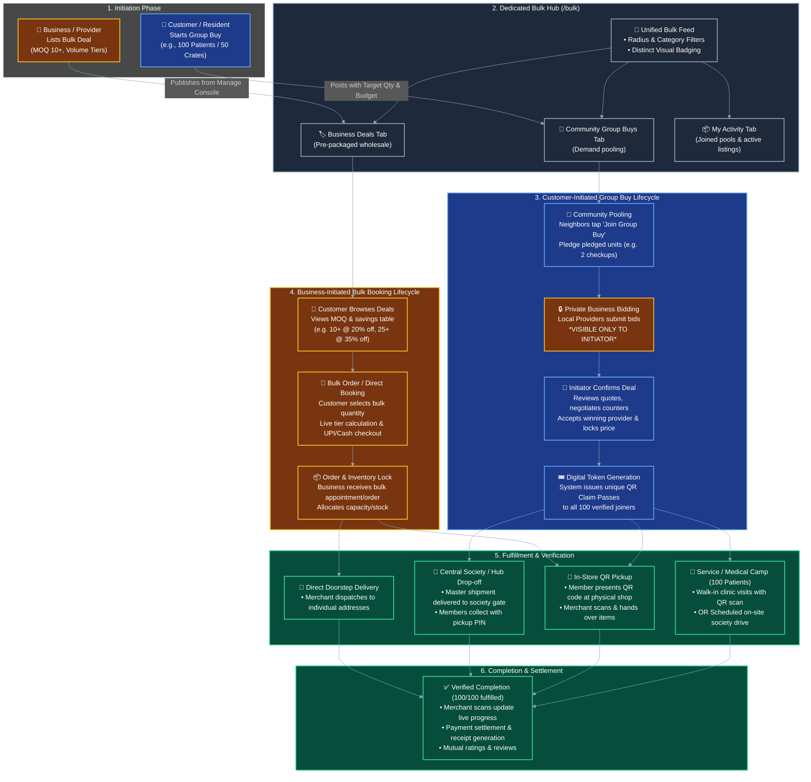
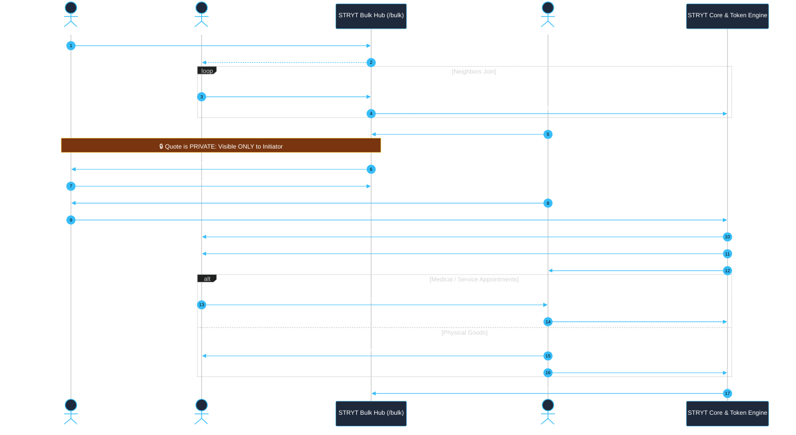
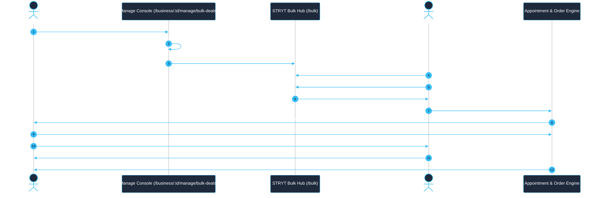

# Implementation Plan: Bulk Booking & Dedicated Bulk Buying Hub

Design and implement a comprehensive **Bulk Booking & Bulk Buying** system for STRYT that supports initiation by **both businesses and customers**, and provides a **dedicated, unified Bulk Buying screen (`/bulk`)** where all business wholesale deals and community group buys are organized in one place and easily distinguishable.

---

## Complete Workflow Diagrams

### 1. Unified Architecture & Dual-Initiation Flowchart



---

### 2. Customer-Initiated Group Buy: Detailed Sequence Workflow



---

### 3. Business-Initiated Bulk Deal: Detailed Sequence Workflow



---

## User Review Required

> [!IMPORTANT]
> **1. Private Business Quoting to Group Initiator**:
> When a customer starts a Group Buy (e.g., 100 people for a health camp, 50 society AC cleanings, or 40 mango crates):
> - Verified businesses & service providers submit proposals/quotes.
> - **Privacy Rule**: These quotes and price breakdowns are visible **ONLY to the Customer Initiator (Organizer)**, keeping negotiations clean and private.
> - **Confirmation Rule**: The initiator reviews offers, negotiates counters, and confirms/accepts the deal to generate a formal binding **Group Agreement**, locking in the final group unit price.

> [!IMPORTANT]
> **2. Post-Close Fulfillment & Distribution for Group Members**:
> Once the initiator closes the deal, how do the 100 participants get their service or product?
> - **Service / Medical / Appointment Case (e.g. 100 Patients / Health Camp / Home Services)**:
>   - Every joined member automatically receives an **Individual Group Pass / Claim Token (with QR code)** in their app (`My Activity` / `Notifications`).
>   - For on-site clinics/hospitals or service visits: Participants show their digital QR pass or book their individual time slots under the group contract.
>   - The provider scans/verifies each token, preventing double-use and tracking real-time completion (e.g. "64 of 100 patients served").
> - **Physical Products / Retail / Wholesale Goods (e.g. Groceries, Hampers, Crates)**:
>   - **Central Hub / Society Drop-off**: Bulk shipment delivered to the initiator / society gate with individual member collection OTPs.
>   - **Individual In-Store Pickup**: Each member visits the physical store and shows their QR Claim Voucher to pick up their allocated quantity.
>   - **Direct Doorstep Delivery**: Provider receives member addresses/slots and delivers directly.

---

## Detailed Specifications

### 1. Dual Initiation Model

#### A. Customer-Initiated Group Buys (e.g., Medical Drives, Society Orders, Wholesales)
- **Initiation**: Customer taps "+ Start Group Buy" from `/bulk` or `/ask`.
- **Parameters**:
  - `title`: e.g. "100 Full-Body Blood Checkups for Silver Oak Society" or "Bulk 50kg Organic Wheat Bags"
  - `targetQuantity` / `groupBuyTarget`: e.g. 100 units/people
  - `targetBudgetPerUnit`: e.g. ₹499/patient (Regular ₹1,200)
  - `category`: Medical / Healthcare, Food & Beverage, Home Services, Retail Goods
  - `fulfillmentPreference`: "On-site Drive", "Clinic/Store Visit", "Central Society Pickup", or "Direct Delivery"
  - `area` & `radiusKm`: Neighborhood radius for neighbor discovery
  - `deadline`: Group pooling expiry date
- **Joining by Community**:
  - Neighbors view the Group Buy on `/bulk` with a live progress bar (`45 of 100 joined`).
  - Neighbors tap **"Join Group Buy"**, choose their required quantity (e.g. 2 checkups for family), and add delivery/patient notes.

#### B. Business-Initiated Bulk Deals (Wholesale / Pre-Packaged Volume Offers)
- **Initiation**: Business creates a deal from their console (`/business/:id/manage/bulk-deals`).
- **Parameters**:
  - Title, description, photos, linked catalog item.
  - Regular Single Price vs Bulk Unit Price.
  - Minimum Order Quantity (MOQ) (e.g. Min 10 units) & Tiered Discounts (e.g. 10+ @ ₹200, 25+ @ ₹170).
  - Maximum available quota / inventory pool.
- **Customer Experience**: Instant bulk booking & checkout from `/bulk` or the business profile.

---

### 2. Private Quoting & Deal Confirmation Flow

1. **Private Quoting**:
   - When a business submits a quote on an open group buy, the proposal is stored with `requestId` and `responderEntityId`.
   - In `requestSelect()` and `RequestDetail.tsx`, proposals on a group buy are filtered to be **visible ONLY to `requesterUserId === currentUserId`**. Other community joiners see only the aggregate pool status and number of quotes received (e.g. "3 providers quoted"), without exposing competitive bids or private terms.
2. **Initiator Review & Counters**:
   - The initiator reviews quotes, checks provider credentials/ratings, and can negotiate counter-offers.
3. **Acceptance & Agreement Generation**:
   - Initiator taps **"Accept Proposal"**.
   - Generates a **Group Agreement** record (`types/requests.ts` -> `Agreement`) locking:
     - `agreedPricePerUnit`
     - `totalCommittedUnits` (e.g. 100)
     - `fulfillmentType` (In-Clinic QR Pass, On-Site Society Camp, Store Pickup, Delivery)
     - `fulfillmentStartDate` & `validUntil`
   - State flips to `AGREED` / `LOCKED`.

---

### 3. Post-Close Fulfillment & Token Distribution System

#### Feature A: Digital QR Claim Pass & Token Generation (`group_buy_tokens`)
- Upon deal confirmation, STRYT generates a unique claim token & QR code for every verified joiner based on their pledged quantity:
  - `tokenId`: Unique cryptographically signed short code (e.g., `STRYT-MED-8492`)
  - `qrData`: Encoded token containing `{ agreementId, userId, quantity, unitPrice, status: "ISSUED" }`
  - `itemDetails`: Item name, business name, address, instructions

#### Feature B: Fulfillment Execution Modes
1. **Service / Medical Appointments (100 Patients / Services)**:
   - **Mode 1 (Fixed Camp / On-Site Date)**: The healthcare provider or technician visits the society/location on scheduled date. Participants line up and present their in-app QR Pass.
   - **Mode 2 (Walk-In / Flexible Booking)**: Each patient opens their pass in `My Activity` -> taps **"Schedule Visit"** or visits the clinic directly during the validity window, presenting their QR pass.
2. **Physical Products / Goods**:
   - **Mode 1 (Centralized Society Drop-off)**: Bulk lot is delivered to society gate / coordinator. Initiator receives the master batch; each member shows their pickup PIN/QR to collect their units.
   - **Mode 2 (In-Store Pickup)**: Member visits the local store, shopkeeper scans the QR pass, and hands over the reserved items.
   - **Mode 3 (Doorstep Delivery)**: Merchant receives batch addresses and delivers to individual households.

#### Feature C: Business Scanner & Real-Time Tracking Console
- On the Business/Provider side (`/business/:id/manage/bulk-deals` or live job screen):
  - **QR Scanner / Token Validator**: Fast in-app camera scanner or manual token entry to validate participant passes.
  - **Live Redemption Counter**: Real-time progress bar (e.g., `87 of 100 fulfilled • 13 pending`).
  - **Payment Reconciliation**: Records payment settlement (individual cash/UPI per pass or master invoice).

---

### 4. Dedicated Bulk Buying Page Architecture (`/bulk`)

```
+-------------------------------------------------------------------------+
|  STRYT Bulk & Group Buys              [ + Start Group Buy ] [ + Post Deal ]|
|  "Neighborhood wholesale & pooling — Buy together, save up to 40%"     |
+-------------------------------------------------------------------------+
| [ All Bulk ]  [ 🏷️ Business Deals ]  [ 👥 Community Group Buys ]  [ 📦 My Activity ] |
+-------------------------------------------------------------------------+
| Filters: [All Categories ▾]  [Within 5 km ▾]  [Sort: Ending Soon ▾]     |
+-------------------------------------------------------------------------+
|                                                                         |
| 🏷️ BUSINESS BULK DEAL                           👥 COMMUNITY GROUP BUY    |
| +------------------------------------+  +-----------------------------+ |
| | Fresh Alphonso Mangoes (Farm Box)  |  | 100 Patient Health Checkup  | |
| | By: Green Valley Agro (Verified)   |  | Initiator: Priya M. (1.2 km)| |
| |                                    |  |                             | |
| | MOQ: 10 Boxes • Save 35%           |  | 68/100 Joined  [====>    ]  | |
| | ₹650/box (Regular ₹1,000)          |  | Target: ₹499/patient        | |
| |                                    |  |                             | |
| | [ Book Bulk Deal ]  [ Share ]      |  | [ Join Group Buy ] [Share]  | |
| +------------------------------------+  +-----------------------------+ |
+-------------------------------------------------------------------------+
```

---

## Proposed Changes (File-by-File)

### 1. Types & Data Models
#### [NEW] [bulk.ts](file:///d:/zetax/name/STRYT/src/types/bulk.ts)
- Data structures for:
  - `BulkDeal`: Business pre-packaged volume deal with MOQ and tiers.
  - `GroupBuyRequest`: Customer pooled request with target units, private proposals list, and status.
  - `GroupBuyToken`: Post-close digital QR claim pass issued to every joined member with redemption status (`ISSUED` | `REDEEMED` | `EXPIRED`).
  - `FulfillmentType`: `"ON_SITE_CAMP" | "CLINIC_VISIT" | "STORE_PICKUP" | "CENTRAL_DROP" | "DOORSTEP"`.

#### [MODIFY] [requests.ts](file:///d:/zetax/name/STRYT/src/types/requests.ts)
- Extend `RequestPost` with `groupBuyTarget`, `bulkPricePerUnit`, `fulfillmentType`, and `groupAgreementId`.
- Extend `Proposal` with `isPrivateToRequester: boolean`.

#### [MODIFY] [index.ts](file:///d:/zetax/name/STRYT/src/types/index.ts)
- Export all bulk and group buy types.

---

### 2. Services Layer
#### [NEW] [bulkService.ts](file:///d:/zetax/name/STRYT/src/services/marketplace/bulkService.ts)
- Methods:
  - `feed(params)`: Fetch blended or tab-filtered bulk deals and open community group buys.
  - `createDeal(businessId, dealData)`: Business creates a wholesale offer.
  - `joinGroupBuy(requestId, quantity, notes)`: Member pledges quantity to pool.
  - `getGroupBuyTokens(requestId)`: Fetch QR claim passes for the logged-in user.
  - `redeemToken(tokenId, businessId)`: Merchant scans and marks token fulfilled.
  - `listMyActivity(userId)`: User's joined pools, issued QR passes, and business deals.

#### [MODIFY] [requestService.ts](file:///d:/zetax/name/STRYT/src/services/engagement/requestService.ts)
- Ensure proposals on group buy requests are only returned/visible to the requester (`requesterUserId`).
- When a group proposal is accepted, trigger generation of `group_buy_tokens` for all joined members.

#### [MODIFY] [constants.ts](file:///d:/zetax/name/STRYT/src/utils/constants.ts)
- Enable `GROUP_BUY_PROGRESS_ENABLED = true;`.

---

### 3. Screen & UI Components
#### [NEW] [BulkBuyingHub.tsx](file:///d:/zetax/name/STRYT/src/screens/BulkBuyingHub.tsx)
- Dedicated `/bulk` screen with tabs (`All Bulk`, `Business Deals`, `Community Group Buys`, `My Activity`), filters, search, and action header.

#### [NEW] [BulkDealCard.tsx](file:///d:/zetax/name/STRYT/src/components/BulkDealCard.tsx)
- Visual card for business wholesale deals with MOQ tags, price tier chips, and direct booking.

#### [NEW] [GroupBuyCard.tsx](file:///d:/zetax/name/STRYT/src/components/GroupBuyCard.tsx)
- Visual card for customer group buys with live progress bar, target unit price, and "Join Group Buy" CTA.

#### [NEW] [JoinGroupBuySheet.tsx](file:///d:/zetax/name/STRYT/src/components/JoinGroupBuySheet.tsx)
- Interactive sheet to join a pool with quantity slider and target contribution calculation.

#### [NEW] [GroupBuyClaimPassModal.tsx](file:///d:/zetax/name/STRYT/src/components/GroupBuyClaimPassModal.tsx)
- Digital QR voucher modal shown to members after deal closes, with instructions for clinic/store redemption or delivery.

#### [NEW] [BulkDealsManager.tsx](file:///d:/zetax/name/STRYT/src/screens/business/manage/BulkDealsManager.tsx)
- Business console page to create/edit bulk deals and scan/validate member QR passes.

#### [MODIFY] [RequestDetail.tsx](file:///d:/zetax/name/STRYT/src/screens/requests/RequestDetail.tsx)
- Group buy proposal section: visible only to creator.
- For joined members after agreement confirmation: displays "Deal Confirmed! View your QR Claim Pass".

#### [MODIFY] [AskCompose.tsx](file:///d:/zetax/name/STRYT/src/screens/requests/AskCompose.tsx)
- Enhanced Group Buy toggle with fields for Target Quantity (e.g. 100), Target Unit Price, and Fulfillment Type.

#### [MODIFY] [App.tsx](file:///d:/zetax/name/STRYT/src/App.tsx)
- Register `/bulk` route and `/business/:id/manage/bulk-deals`.

#### [MODIFY] [DesktopSidebar.tsx](file:///d:/zetax/name/STRYT/src/components/DesktopSidebar.tsx) & [Home.tsx](file:///d:/zetax/name/STRYT/src/screens/Home.tsx)
- Add "Bulk Buying" navigation links and discovery banners.

---

## Verification Plan

### Automated Verification
1. **TypeScript Build & Lint Check**:
   ```bash
   npm run build
   ```
2. **Unit Tests**:
   ```bash
   npm run test
   ```
   Verify pricing tier calculations, pool progress calculation, private quote visibility filtering, and QR pass generation logic.

### Manual Verification
1. **Privacy & Quoting**:
   - Create a Group Buy with Account A (Customer Organizer).
   - Sign in as Account B (Business Provider) and submit a bulk proposal.
   - Sign in as Account C (Neighbor Joiner) and verify proposal details/prices are **hidden**.
   - Sign in as Account A, verify proposal is **visible**, and accept it to create the Agreement.
2. **Post-Close Token & QR Pass Distribution**:
   - Check Account C's `My Activity` / `Notifications` to verify an individual QR Claim Pass was issued for their pledged quantity.
   - Test scanning/redeeming the QR token from the Business Manager console.
3. **Dedicated Page & Distinction**:
   - Navigate to `/bulk` and test all filter tabs (`All Bulk`, `Business Deals`, `Community Group Buys`, `My Activity`).
   - Confirm clear visual distinction between business wholesale offers and community pools.
