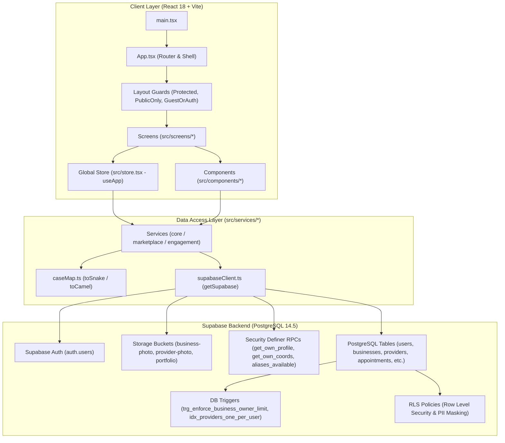
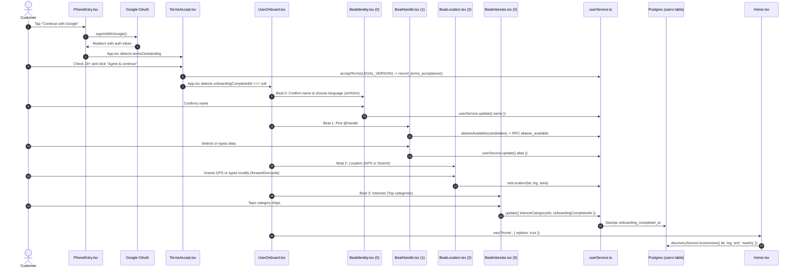
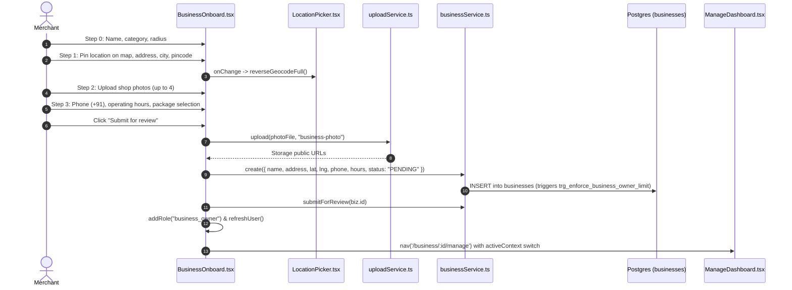
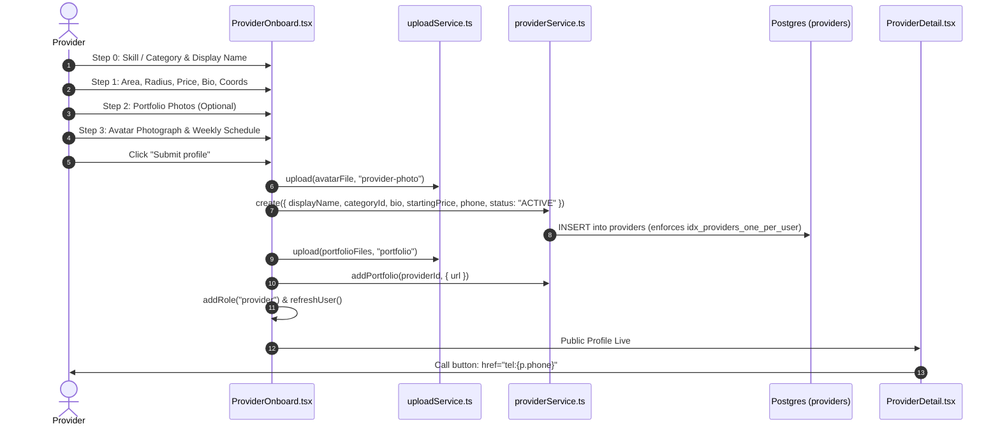
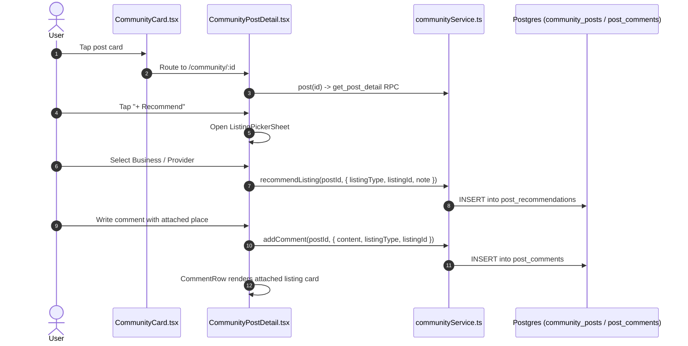

# STRYT — Architecture & Code Graph for LLMs & Engineers

> **Purpose:** A structured, graph-oriented blueprint of the STRYT application designed for LLMs, autonomous agents, and senior engineers. It maps the end-to-end execution paths, state transitions, entity relationships, security boundaries, and known failure archetypes so you can troubleshoot, navigate, and modify the codebase with zero hallucinations and pinpoint precision.
>
> ⚡ **Machine-Readable Graph for Fast LLM Parsing:** A condensed, indexed JSON version of this graph is available at [`docs/engineering/code_graph.json`](./code_graph.json).

---

## 1. How an LLM Must Use This Graph

When diagnosing an issue, auditing a flow, or planning a feature:
1. **Locate the Flow in the Execution Graph (§3):** Trace the path from the user's entry point down through UI components, store hooks, services, RPCs, and PostgreSQL tables.
2. **Check the Identity & Context Boundary (§2):** Verify which "hat" the user is wearing (`customer`, `business`, `provider`, or `delivery`) and whether `activeContext` and `roles` are synchronized.
3. **Verify Security & PII Masking (§5):** Do not attempt raw `.select()` queries for sensitive columns (`phone`, `lat`, `lng`, `emergency_contact`). Always use the corresponding `SECURITY DEFINER` RPCs.
4. **Consult the Troubleshooting Decision Trees (§6):** Check known architectural failure modes before writing code.
5. **Enforce the Verification Protocol (§7):** Always validate type safety with `npx tsc --noEmit` before concluding.

---

## 2. High-Level System Architecture Graph



---

## 3. Entity & Identity Graph (The Tri-Hat Model)

STRYT operates on a multi-tenant, role-swapping architecture where a single physical user can act in four distinct contexts ("hats"):

```mermaid
graph LR
    User["users table (id = auth.uid)"]
    User -->|roles: ['customer']| CustomerHat["Customer Hat (/home, /explore)"]
    User -->|roles: ['business_owner']| BusinessHat["Business Owner Hat (/business/:id/manage)"]
    User -->|roles: ['provider']| ProviderHat["Provider Hat (/provider/:id/manage)"]
    User -->|access_grants| DeliveryHat["Delivery Agent Hat (/delivery)"]

    CustomerHat -->|Lists Spot| BusinessOnboard["/onboard/business"]
    CustomerHat -->|Offers Skill| ProviderOnboard["/onboard/provider"]
    BusinessOnboard -->|Inserts| BizRow["businesses table (owner_user_id)"]
    ProviderOnboard -->|Inserts| ProvRow["providers table (user_id)"]
```

### Invariants & Gotchas:
- **`activeContext` (`src/store.tsx:412`):** Stored in `localStorage`. Must be `{ type: "customer" | "business" | "provider", id: string | null, name?: string }`. Changing context updates what the sidebar, header, and back buttons render.
- **`roles` Array (`users.roles`):** Contains `['customer', 'business_owner', 'provider']`. A user cannot access `/business/:id/manage` or `/provider/:id/manage` without the matching role and ownership grant.
- **Role Assignment Race Condition:** Calling `addRole()` must await `userService.update()` before triggering `refreshUser()`. If un-awaited, `refreshUser()` queries the database before the write finishes, silently overwriting `roles` back to `['customer']`.

---

## 4. End-to-End Flow Graphs

### Flow A: Customer Onboarding & First Arrival
Path: User signs up via Google OAuth → Accepts clickwrap terms → Answers 4 beats → Arrives on Home.



#### Diagnostic Nodes for Flow A:
- **Google user skips Beat 0:** Check `UserOnboard.tsx:51-56`. If `isUnusableName(user.name)` is false, it incorrectly advances to Beat 1, bypassing the language selector.
- **Nominatim 429 Rate Limit:** Check `BeatLocation.tsx:101-109`. Search input lacks debouncing.
- **Home header says `"neighborhood_placeholder"`:** Check `BeatLocation.tsx:89`. If reverse geocoding returns an empty area string, `area` is saved as `null`.

---

### Flow B: Business Onboarding & Storefront Setup
Path: Merchant visits `/onboard/business` → 4 Steps → DB Insert → Review Submission → Management Console.



#### Diagnostic Nodes for Flow B:
- **Phone clipping on paste:** Check `BusinessOnboard.tsx:196`. `maxLength={10}` on raw input clips `+91` numbers to 9 digits before non-digit stripping.
- **Missing hours on retail/dining:** Check `BusinessOnboard.tsx:124-126`. Operating hours are wrongly nullified if `wantsBookings` is false.
- **Photos cannot be removed:** Check `BusinessOnboard.tsx:80-84`. Thumbnail wrapper has no delete button or `URL.revokeObjectURL`.
- **5-business capacity crash:** Check `trg_enforce_business_owner_limit`. Throws `BUSINESS_OWNER_LIMIT_REACHED` if user already owns 5 businesses.

---

### Flow C: Service Provider Onboarding & Discovery
Path: Technician/Pro visits `/onboard/provider` → 4 Steps → DB Insert → Portfolio Upload → Live Search.



#### Diagnostic Nodes for Flow C:
- **Customer cannot call provider:** Check `ProviderOnboard.tsx`. Form lacks a `phone` input, leaving `providers.phone = null`. `ProviderDetail.tsx:184` hides the Call button when phone is null.
- **Custom category results in NULL:** Check `ProviderOnboard.tsx:74, 86`. Typing `newCat` sets `cat = null`, passing `categoryId = undefined` and `categoryName = undefined`.
- **Bricked on retry:** Check `ProviderOnboard.tsx:84-111`. If portfolio upload fails, the provider row was already created. Retrying crashes on `idx_providers_one_per_user` (1 provider per user limit).

---

### Flow D: Community Discussions & Recommendations
Path: Customer/Merchant visits Community Feed → Views Recommendation Request → Recommends Local Business or Attaches Listing to Comment.



#### Diagnostic Nodes for Flow D:
- **Detail page missing "+ Recommend":** Feed card `CommunityCard.tsx:910` has the button, but `CommunityPostDetail.tsx:828` only renders the results array without the trigger.
- **Attached listing dead code in UI:** Schema supports `post_comments.listing_type` and `listing_id`, but `CommunityPostDetail.tsx:1002` comment composer lacks the picker trigger button.
- **Bookmarks missing Community tab:** `communityService.savedPosts()` exists, but `Bookmarks.tsx:13` only lists tabs for `BUSINESS`, `PROVIDER`, `REQUEST`, `FOLLOWING`.

---

## 5. Security & PII Column Masking Graph

STRYT enforces strict column-level privacy via PostgreSQL policies and `SECURITY DEFINER` functions:

| Sensitive Column | Table | Why it is blocked from plain `select()` | Allowed Access Mechanism |
| :--- | :--- | :--- | :--- |
| `phone` | `users` | Prevents phone scraping by strangers | `get_own_profile()` RPC (scoped to `auth.uid()`) |
| `lat`, `lng` | `users` | Protects residential privacy of customers | `get_own_coords()` RPC (returns exact coords only for self) |
| `emergency_contact` | `users` | Protects SOS safety contact details | `get_own_emergency_contact()` RPC |
| `business_premises` | `businesses` | Shop location is public, but owner coordinates are private | `businesses.lat`, `businesses.lng` (publicly readable) |
| `provider_coords` | `providers` | Service radius is public; exact home pin is masked | Coords readable only for active bookings/proposals |

### Mandatory Pattern for Developers & LLMs:
```ts
// ❌ WRONG — Will throw RLS error or return null/undefined:
const { data } = await sb.from("users").select("phone, lat, lng").eq("id", uid).single();

// ✅ CORRECT — Calls the Security Definer RPC:
const { data: profile } = await sb.rpc("get_own_profile").maybeSingle();
const { data: coords } = await sb.rpc("get_own_coords").maybeSingle();
```

---

## 6. The AI Troubleshooting Engine (Symptom → Code Graph Path)

Use this quick-lookup matrix when diagnosing bugs:

| Symptom | Trace Path | Root Cause | Fix Location |
| :--- | :--- | :--- | :--- |
| **"User loses merchant/provider role on page refresh"** | `store.tsx:addRole` → `refreshUser()` → `get_own_profile` | `addRole` fires un-awaited `userService.update()`. `refreshUser()` reads old DB state in parallel and overwrites. | Await `userService.update()` in `store.tsx:626` |
| **"Customer cannot call service provider"** | `ProviderDetail.tsx:184` → reads `p.phone` → `providers.phone` in DB | `ProviderOnboard.tsx` never asks for phone number; payload saves `phone: null`. | Add phone input in `ProviderOnboard.tsx:31` & wire to service |
| **"Phone number fails validation on submit"** | `BusinessOnboard.tsx:196` → `phone.replace(/\D/g, "")` | `maxLength={10}` on HTML `<input>` truncates `+91` numbers to 9 digits before non-digit stripping. | Strip prefix in `onChange` before slicing to 10 digits |
| **"Store hours disappear on public listing"** | `BusinessOnboard.tsx:124` → `hours` column in `businesses` | `hours` is conditionally set to `undefined` if `wantsBookings` is false. Physical shops get NULL hours. | Decouple store operating hours from appointment bookings |
| **"Retry onboarding fails with duplicate error"** | `providerService.create()` → `idx_providers_one_per_user` | Row inserted before photo upload. If upload fails, subsequent submit crashes on unique constraint. | Upload photos before row insertion, or make retry idempotent |
| **"Search dropdown goes blank while typing area"** | `BeatLocation.tsx:101` → `forwardGeocode()` → Nominatim | Input lacks debounce. Fires 10+ requests in 1 second; Nominatim returns HTTP 429 Too Many Requests. | Add 400ms debounce timer in `BeatLocation.tsx` |
| **"Brand new user never sees language switcher"** | `UserOnboard.tsx:51` → `isUnusableName()` | Google OAuth seeds real name. `isUnusableName` is false, jumping router straight to Beat 1. | Base initial beat on `ob_beat_${user.id}` rather than name check |
| **"Unauthenticated user fills form and gets 401"** | `App.tsx:643` → `/onboard/business` | Route lacks authentication guard. User fills 4 steps and crashes on final submit. | Add auth check on mount in `BusinessOnboard.tsx` & `ProviderOnboard.tsx` |
| **"New user skips location step on shared device"** | `UserOnboard.tsx:38` → `localStorage.getItem("ob_beat")` | Local storage key is global (`"ob_beat"`), not scoped by user ID. Previous user's step bleeds over. | Scope key to `ob_beat_${user.id}` |
| **"Category chip displays truncated word (e.g. 'Home')"** | `BusinessOnboard.tsx:210` → `c.name.split(" ")[0]` | Name string split on space destroys multi-word categories ("Home Services" → "Home"). | Render full `c.name` with CSS text-overflow |

---

## 7. Verification & Testing Protocol

Before committing any fix or proposing changes, verify against the repository invariants:

1. **TypeScript Typecheck:**
   ```bash
   npx tsc --noEmit
   ```
   *STRYT enforces `noUnusedLocals` and strict type checks. Any unused import or variable will fail compilation.*

2. **Vite Production Build:**
   ```bash
   npm run build
   ```

3. **Database Column Whitelist Check:**
   When adding a field to `businessService`, `providerService`, or `userService`, ensure it is explicitly added to the corresponding `COLUMNS` Set (`BUSINESS_COLUMNS`, `PROVIDER_COLUMNS`, `USER_COLUMNS`). Unlisted columns are silently dropped by `pickColumns()`.

4. **Public Interface Integrity:**
   Ensure casing conventions are preserved:
   - **Database (PostgreSQL):** `snake_case` (`owner_user_id`, `is_available_now`, `category_id`)
   - **Application (TypeScript):** `camelCase` (`ownerUserId`, `isAvailableNow`, `categoryId`)
   - Mapped via `src/lib/caseMap.ts` (`toSnake` on write, `toCamel` on read).
