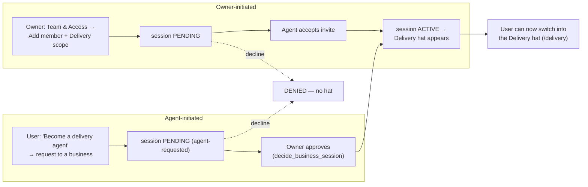
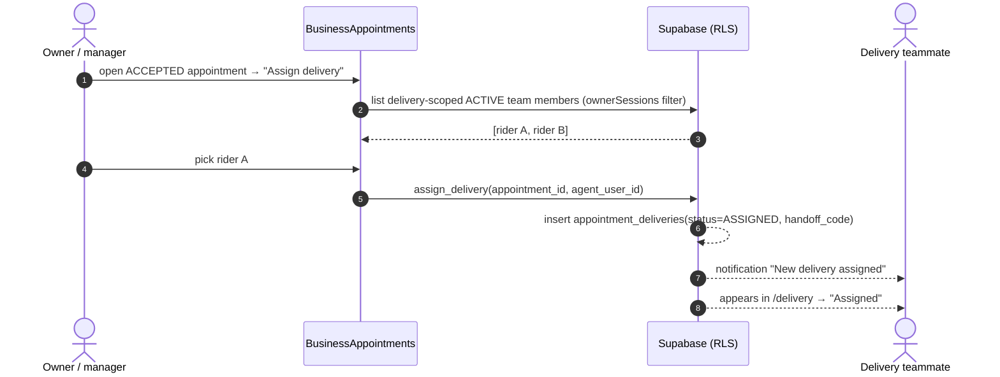
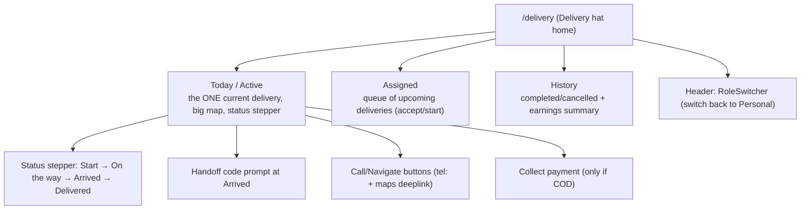

# Task 9 — Delivery Agent Flow (matured plan)

Delivery is modelled as a **first-class "hat"** (like customer / business /
provider), earned through a **request → accept handshake**, assignable **only to
team members**, and presented in a **focused, scoped, Apple-grade delivery
console**. This revision folds in four requirements:

1. A delivery agent gets a **dedicated, delivery-only profile** they can switch
   into/out of — it only appears **after** a request is accepted.
2. A business assigns a delivery **only to its own team members**.
3. A team member sees **only what their scope allows**, with team-useful actions.
4. **Apple-grade UX**: every function has a deliberate home; work and UX balanced.

> Still plan-first. It rides almost entirely on machinery that already exists
> (context/hat switching, team grants + scopes + the PENDING→ACTIVE acceptance
> handshake, and the agreement live-tracking template). Net-new is small.

---

## 1. Delivery as a switchable hat (identity model)

The app already has hats via `activeContext` (`{type, id, name}`), surfaced by
`useAccountOptions` → `RoleSwitcher` (`ICONS`/`COLORS` per type) and entered via
`attemptSwitchContext` (PIN-gated) with `contextHomePath` deciding "home".

Add a **`delivery`** hat type:

| Piece | Change |
|---|---|
| `ActiveContext.type` (store) | add `"delivery"`; `id` = the delivery-team membership id (or businessId) |
| `AccountOption.type` + `RoleSwitcher` `ICONS`/`COLORS` | add `delivery` → 🛵 icon, teal accent |
| `useAccountOptions` | append a **Delivery** option when the user has ≥1 ACTIVE grant carrying the `delivery` scope; `dest = "/delivery"` |
| `contextHomePath` | `if (ctx.type === "delivery") return "/delivery"` |
| routes (`App.tsx`) | new `/delivery` console tree under a `RequireDeliveryAgent` guard |

**Key UX rule:** switching into the Delivery hat lands on the **focused
`/delivery` console**, NOT `/business/:id/manage`. A delivery-only teammate never
sees the business console at all (req. 1 + 3). If a person has both `delivery`
and, say, `queue` scope, they get **two** hats: "Delivery" (focused agent view)
and the scoped business console — cleanly separated.

---

## 2. Becoming a delivery agent — the request → accept handshake

Reuse `business_access_sessions` which already has
`AccessStatus = PENDING | ACTIVE | EXPIRED | REVOKED | DENIED` and
`decide_business_session(session_id, approve)`. Delivery membership is just a
team grant whose `scopes` include `delivery`. The handshake is **two-way**:



- **Only after ACTIVE** does the Delivery hat surface in the switcher (req. 1:
  "if a delivery agent request anyone accept then only the delivery user page
  will come").
- Revocation is already handled: `useAccountOptions`'s effect drops a hat the
  moment its grant leaves ACTIVE — the Delivery hat disappears instantly on
  revoke, bouncing the user out (mirror the existing business-revoke path).

New scope value (extends `businessAccessService.ts`):
```ts
export type Scope = "appointments" | "queue" | "catalog" | "leads" | "delivery";
SCOPE_LABELS.delivery = "Delivery";
```
Plus a matching `has_business_scope(business_id, uid, 'delivery')` RLS branch and
a preset in the Team sheet (`PRESETS`): **"Delivery rider" → ['delivery']**.

---

## 3. Business assigns a delivery — team members only (req. 2)

Assignment is per-appointment and the picker is **filtered to ACTIVE team
members of that business whose scopes include `delivery`** — never an arbitrary
contact.



Guard: `assign_delivery` RPC verifies the caller can manage the business
(`can_manage_business` / owner) **and** the target is a delivery-scoped member of
that same business — so you can't assign to someone off-team.

---

## 4. What a delivery teammate can/can't see (req. 3)

The Delivery hat is intentionally **minimal and task-focused**:

| Delivery agent SEES | Delivery agent does NOT see |
|---|---|
| Their own assigned deliveries (this business) | Catalogue, pricing, reviews, payments dashboard |
| Customer name + address **only while delivery active** (alias after) | Other teammates' deliveries, other customers |
| The delivery map + status controls + handoff code | Business settings, verification, team management |
| Pay-on-delivery confirm (only if that appointment is COD) | Anything outside `delivery` scope |

Enforced three ways (defense in depth, matching existing pattern):
- **Route:** `/delivery/*` behind `RequireDeliveryAgent`; any business route stays
  behind `RequireScope` (a delivery-only member fails every non-delivery scope).
- **Server:** `appointment_deliveries` RLS restricts rows to the assigned agent +
  the business's managers; `ownerVisibleCustomerName`-style alias reveal.
- **UI:** the delivery console renders its own nav — none of the business
  console chrome is reachable.

---

## 5. The Delivery console — screens & function placement (req. 4)

A dedicated, single-purpose surface. Where each function lives is chosen so the
agent's hands-busy, on-the-move context stays one-tap simple.



**Apple-grade UX principles applied**
- **One primary action at a time.** The Active tab shows a single delivery with a
  large map and a **status stepper** (mirrors `AgreementScreen.handleLiveStep`);
  the next action is always the biggest button.
- **Thumb-first.** Status control + Navigate + Call sit in a bottom action bar,
  reachable one-handed while moving.
- **Progressive disclosure.** Handoff code + payment appear **only at the step
  they matter** (Arrived / COD), never as upfront clutter.
- **Live feedback.** Optimistic status flips + haptics (`haptics.success`), GPS
  pushed every 30s while `ON_THE_WAY` (proven pattern), customer sees it move.
- **Calm empty states.** "No deliveries right now" with the agent's on/off-duty
  toggle, not a dead screen.
- **Clear identity.** The `RoleSwitcher` in the header makes "you're in Delivery
  mode" obvious and switching back to Personal one tap — never trapped.

**Placement on the other two sides**
- **Owner/manager:** "Assign delivery" lives on the **appointment detail** in
  `BusinessAppointments` (where the job already is), plus a small "Deliveries"
  filter — not a separate top-level tab (keeps the console uncluttered).
- **Customer:** a **Track** button on the appointment card in `MyAppointments`
  once a delivery is EN_ROUTE, opening the existing public `TrackingPage`.

---

## 6. Live delivery, tracking, handoff & payment (reuse)

The moving/tracking half is the agreement template pointed at an appointment:

```mermaid
sequenceDiagram
    autonumber
    actor A as Delivery agent (/delivery)
    participant DB as Supabase
    actor C as Customer
    participant T as /track/:token (public)
    A->>DB: start → status EN_ROUTE, live_status ON_THE_WAY
    loop every 30s while EN_ROUTE
        A->>DB: appointment_update_delivery_status(lat,lng)  %% clone of agreement_update_live_status
    end
    C->>T: Track button → get_tracking(token) poll 15s
    A->>C: Arrived → handoff code
    C-->>A: shows/reads code
    A->>DB: confirm_handoff(code) → ARRIVED (verified)
    opt Pay on delivery
        C->>DB: appointment_claim_payment(UPI ref)
        A->>DB: appointment_confirm_payment
    end
    A->>DB: markDelivered → DELIVERED, live_status DONE
    DB-->>DB: appointment_transition(COMPLETED); token expires; names→alias
    DB-->>C: "Delivered ✓"
```

Reuses verbatim: `nativeGeolocation`, the `LEAVING/ON_THE_WAY/ARRIVED/DONE`
status vocab, `tracking_tokens` + `get_tracking` + `TrackingPage`, appointment
payment RPCs, and the `ownerVisibleCustomerName` alias-reveal window (Task 8).

---

## 7. Data model + RLS (additive)

```
delivery grant  = a business_access_sessions row whose scopes @> {'delivery'}
                  (status PENDING→ACTIVE handshake, reused as-is)

appointment_deliveries
  id text pk · appointment_id fk · business_id fk
  agent_user_id fk -> users(id)          -- must be a delivery-scoped member
  status ASSIGNED|EN_ROUTE|ARRIVED|DELIVERED|CANCELLED
  handoff_code text · lat/lng double · live_status text
  created_at · delivered_at
```
RLS: row read/write to the assigned `agent_user_id` and the business managers
(`has_business_scope(business_id,uid,'delivery')` or owner); customer of the
appointment gets read-only; public sees only via the tracking-token RPC.

New RPCs (thin clones of proven ones): `assign_delivery`,
`appointment_update_delivery_status`, `confirm_handoff`. Generalize
`tracking_tokens` with a nullable `appointment_id` so `TrackingPage` +
`get_tracking` are reused with minimal change.

---

## 8. Phased rollout — STATUS
- **P1 (safe/additive): ✅ DONE.** `delivery` scope in the grant whitelist;
  `appointment_deliveries` table + RLS; RPCs (assign/update/confirm/token);
  generalized `tracking_tokens`. Migrations `20260845`. Feature-flagged off.
- **P2 (hat + console): ✅ DONE.** `delivery` context type end-to-end (store,
  `useAccountOptions`, `RoleSwitcher`/`AccountSwitcher`, `contextHomePath`,
  `/delivery` route + `RequireDeliveryAgent`); focused Delivery console
  (Active/Assigned/History). `my_deliveries` RPC (`20260846`).
- **P3 (assignment + tracking): ✅ DONE.** Owner "Assign delivery" on the
  appointment card (`DeliveryAssignControl`); agent GPS live-push (30s) + handoff
  verification in the console; customer Track button + handoff code
  (`DeliveryTrackControl`); `delivery` scope + "Delivery rider" preset in Team &
  Access. DB refinements `20260847` (hide code from agent, gate DONE on handoff,
  let customer mint tracking token).

### Phase 4 — batches (code written earlier, DB applied 2026-07-27)
`20260848_delivery_batches_phase4.sql` adds multi-stop runs (`delivery_batches`,
`assign_delivery_batch`, `accept_delivery_batch`/`decline_delivery_batch`,
`update_delivery_batch_position`), the captured delivery address on
`appointment_create`, a live map + route polyline in the agent console, and the
"out for delivery"/"delivered" customer notifications.

> ⚠️ **This file was committed but never applied to the database.** The client
> was already calling the widened 15-arg `appointment_create` while production
> still had the 11-arg version, so **every appointment booking failed** until it
> was applied on 2026-07-27. Two blockers had to be fixed first: `my_deliveries`
> and `get_tracking` both widen their `RETURNS TABLE`, which `CREATE OR REPLACE`
> rejects — each needs an explicit `DROP FUNCTION`. Lesson: a migration file in
> the repo is not evidence it ran; check `list_migrations` against the DB.

### Phase 5 — home delivery, owner tracking, customer restriction (2026-07-27)
- `20260851_home_delivery_toggle_and_eta.sql` — `businesses.delivery_enabled`
  (per-shop opt-in, enforced in `appointment_create`, not just hidden in the UI)
  and the **two-way ETA**: customer states `requested_delivery_window` at
  booking, business confirms/overrides via `appointment_accept_with_eta`, which
  flips status and notifies in one transaction. Owner sees straight-line
  distance shop→address at acceptance (`haversineKm`).
- `20260852_business_active_deliveries.sql` — owner-side mirror of
  `my_deliveries()`, backing the new **live tracking page**
  (`/business/:id/manage/deliveries`, `BusinessDeliveries.tsx`): agent positions
  on a map, route polyline, filter per agent and per order.
- `20260853_customer_delivery_progress_only.sql` — **customers no longer get
  live tracking.** `get_tracking`'s delivery branch returns NULL coordinates,
  the customer's direct RLS SELECT on `appointment_deliveries` is removed, and
  `my_delivery_progress()` reveals the agent's name/phone/photo only once *their*
  delivery is EN_ROUTE. Enforced server-side because the tracking token is
  shareable and `get_tracking` is granted to `anon`.
- Multi-stop routing (`src/lib/routeLink.ts`): one consolidated best-route deep
  link through every remaining stop, plus tap-to-select a subset. Capped at
  Google Maps' 9-waypoint URL limit, surfaced to the agent.
- `20260854_revoke_anon_on_delivery_rpcs.sql` — the phase 1-4 migrations granted
  to `authenticated` without revoking Postgres' default PUBLIC grant, leaving
  every delivery RPC anon-callable (harmless — they all raise UNAUTHENTICATED —
  but inconsistent). Only `get_tracking` stays anon, by design.

**Sequential notification chain** (verified, no change needed): batch assign
notifies only the *agent*; accept notifies nobody; each customer is notified on
their own stop's EN_ROUTE, and `DONE` is gated on `handoff_verified`. So
customer *n+1* only hears anything after *n*'s OTP handoff completes.

### To go live
`DELIVERY_AGENT_ENABLED` in `src/lib/features.ts` is still **`false`** pending an
end-to-end test with two real accounts (owner + delivery-scoped team member).
Flipping it reveals: the Delivery role in Team & Access, the Delivery hat in the
account switcher, the `/delivery` console, the Live deliveries page in the
Business hub, and the assign/track controls on appointment cards.

## 9. Decisions (resolved per requirements)
- Agent identity → **existing STRYT user + team member only** (req. 2); no ad-hoc
  contacts. Cleanest RLS + alias privacy.
- Delivery is a **team scope**, not an arbitrary assignment (req. 2/3).
- Delivery is a **separate focused hat**, not the business console (req. 1/3).
- Handshake reuses `business_access_sessions` PENDING→ACTIVE (two-way).

## Risk
Medium once built (live location + payments). P1 additive/safe; P2–P3 mirror
already-proven context-switch + agreement-tracking code, so risk is contained.
No destructive changes.
